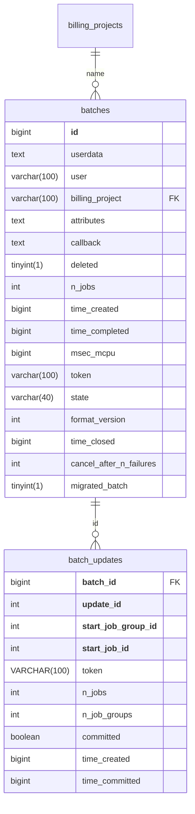

# Batch Database UML Diagram - Batches

```mermaid
---
config:
  layout: dagre
---
erDiagram
direction TB

	batches {
		bigint **id** ""
		text userdata  ""
		varchar(100) user  ""
		varchar(100) billing_project FK ""
		text attributes  ""
		text callback  ""
		tinyint(1) deleted  ""
		int n_jobs  ""
		bigint time_created  ""
		bigint time_completed  ""
		bigint msec_mcpu  ""
		varchar(100) token  ""
		varchar(40) state  ""
		int format_version  ""
		bigint time_closed  ""
		int cancel_after_n_failures  ""
		tinyint(1) migrated_batch  ""
	}
	batch_updates{
		bigint **batch_id** FK ""
		int **update_id** ""
		int **start_job_group_id** ""
		int **start_job_id** ""
		VARCHAR(100) token ""
		int n_jobs ""
		int n_job_groups ""
		boolean committed ""
		bigint time_created ""
		bigint time_committed ""
	}


	%% Links to batch_updates:
	batches ||--o{ batch_updates : "id"

	%% Links to batches:
	%% user_resources ||--o{ batches:"user"
	billing_projects ||--o{ batches:"name"

```
