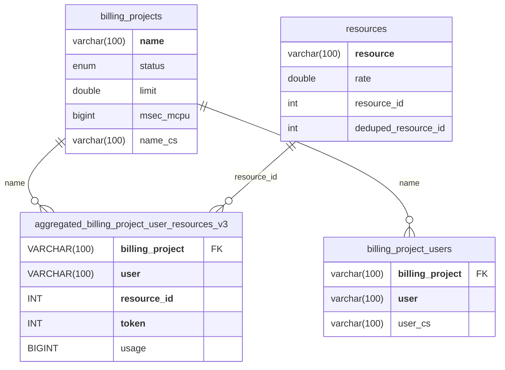

# Batch Database UML Diagram - Billing Projects

```mermaid
---
config:
  layout: dagre
---
erDiagram
direction TB

	%% For future editors: I encourage you to try and find a way to make this Mermaid diagram more organized.
	%% It is, as of now, a task beyond my capabilities.


	billing_project_users {
		varchar(100) **billing_project** FK ""
		varchar(100) **user** ""
		varchar(100) user_cs  ""
	}
	billing_projects {
		varchar(100) **name** ""
		enum status  ""
		double limit  ""
		bigint msec_mcpu  ""
		varchar(100) name_cs ""
	}


	aggregated_billing_project_user_resources_v3 {
		VARCHAR(100) **billing_project** FK ""
		VARCHAR(100) **user** ""
		INT **resource_id** ""
		INT **token** ""
		BIGINT usage ""
	}

	resources {
		varchar(100) **resource** ""
		double rate  ""
		int resource_id ""
		int deduped_resource_id  ""
	}

	%% Links to aggregated_billing_project_user_resources_v3:
	billing_projects ||--o{ aggregated_billing_project_user_resources_v3:"name"
	resources ||--o{ aggregated_billing_project_user_resources_v3:"resource_id"


	%% Links to billing_project_users:
	billing_projects ||--o{ billing_project_users :"name"
```
