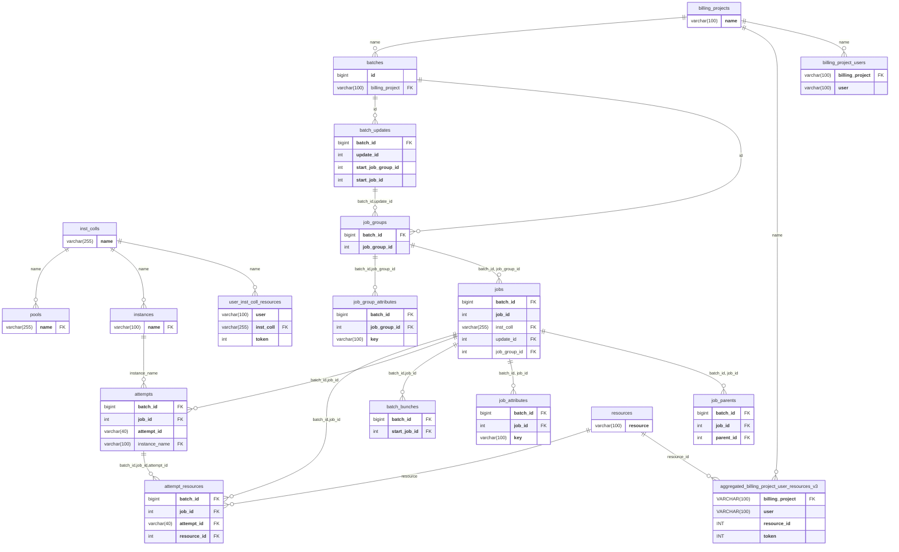

# Batch Database UML Diagram (simplified)

This diagram is is a simplified version of `estimated-current.md`, whose description can be found on that diagram. Like `estimated-current.md`, this serves to be a visual representation of `estimated-current.sql`, however it has been simplified by **only including the primary and foreign keys for a given table**.

Conventions:
- Primary keys are listed in order as the first rows of each table, and are denoted by **bold text**.
- Foreign keys are denoted by `FK` in the rightmost column, and are further denoted via connections between two tables.

