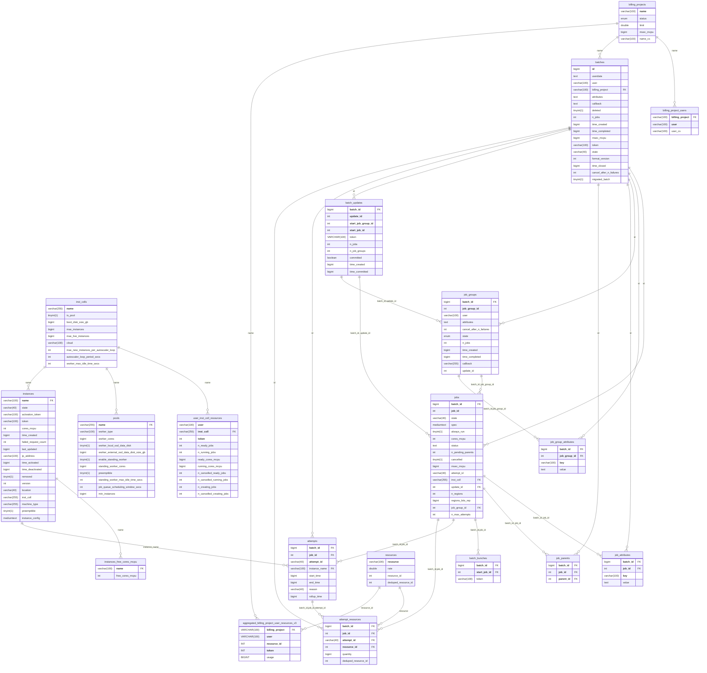

# Batch Database UML Diagram (full)

```mermaid
---
config:
  layout: dagre
---
erDiagram
direction TB

	%% For future editors: I encourage you to try and find a way to make this Mermaid diagram more organized.
	%% It is, as of now, a task beyond my capabilities.

	inst_colls {
		varchar(255) **name** ""
		tinyint(1) is_pool  ""
		bigint boot_disk_size_gb  ""
		bigint max_instances  ""
		bigint max_live_instances  ""
		varchar(100) cloud  ""
		int max_new_instances_per_autoscaler_loop  ""
		int autoscaler_loop_period_secs  ""
		int worker_max_idle_time_secs  ""
	}
	pools {
		varchar(255) **name** FK ""
		varchar(100) worker_type  ""
		bigint worker_cores  ""
		tinyint(1) worker_local_ssd_data_disk  ""
		bigint worker_external_ssd_data_disk_size_gb  ""
		tinyint(1) enable_standing_worker  ""
		bigint standing_worker_cores  ""
		tinyint(1) preemptible  ""
		int standing_worker_max_idle_time_secs  ""
		int job_queue_scheduling_window_secs  ""
		bigint min_instances  ""
	}
	user_inst_coll_resources {
		varchar(100) **user** ""
		varchar(255) **inst_coll** "FK"
		int **token** ""
		int n_ready_jobs  ""
		int n_running_jobs  ""
		bigint ready_cores_mcpu  ""
		bigint running_cores_mcpu  ""
		int n_cancelled_ready_jobs  ""
		int n_cancelled_running_jobs  ""
		int n_creating_jobs  ""
		int n_cancelled_creating_jobs  ""
	}
	batches {
		bigint **id** ""
		text userdata  ""
		varchar(100) user  ""
		varchar(100) billing_project FK ""
		text attributes  ""
		text callback  ""
		tinyint(1) deleted  ""
		int n_jobs  ""
		bigint time_created  ""
		bigint time_completed  ""
		bigint msec_mcpu  ""
		varchar(100) token  ""
		varchar(40) state  ""
		int format_version  ""
		bigint time_closed  ""
		int cancel_after_n_failures  ""
		tinyint(1) migrated_batch  ""
	}
	jobs {
		bigint **batch_id** FK ""
		int **job_id** ""
		varchar(40) state  ""
		mediumtext spec  ""
		tinyint(1) always_run  ""
		int cores_mcpu  ""
		text status  ""
		int n_pending_parents  ""
		tinyint(1) cancelled  ""
		bigint msec_mcpu  ""
		varchar(40) attempt_id  ""
		varchar(255) inst_coll FK ""
		int update_id FK ""
		int n_regions  ""
		bigint regions_bits_rep  ""
		int job_group_id FK ""
		int n_max_attempts  ""
	}
	batch_updates{
		bigint **batch_id** FK ""
		int **update_id** ""
		int **start_job_group_id** ""
		int **start_job_id** ""
		VARCHAR(100) token ""
		int n_jobs ""
		int n_job_groups ""
		boolean committed ""
		bigint time_created ""
		bigint time_committed ""
	}
	job_parents {
		bigint **batch_id** FK ""
		int **job_id** FK ""
		int **parent_id** FK ""
	}
	job_attributes {
		bigint **batch_id** FK ""
		int **job_id** FK ""
		varchar(100) **key** ""
		text value  ""
	}
	job_group_attributes {
		bigint **batch_id** FK ""
		int **job_group_id** FK ""
		varchar(100) **key**  ""
		text value  ""

	}
	batch_bunches {
		bigint **batch_id** FK ""
		int **start_job_id** FK ""
		varchar(100) token  ""
	}
	attempt_resources {
		bigint **batch_id** FK ""
		int **job_id** FK ""
		varchar(40) **attempt_id** FK ""
		int **resource_id** FK ""
		bigint quantity  ""
		int deduped_resource_id  ""
	}
	attempts {
		bigint **batch_id** FK ""
		int **job_id** FK ""
		varchar(40) **attempt_id** ""
		varchar(100) instance_name FK ""
		bigint start_time  ""
		bigint end_time  ""
		varchar(40) reason  ""
		bigint rollup_time  ""
	}
	billing_project_users {
		varchar(100) **billing_project** FK ""
		varchar(100) **user** ""
		varchar(100) user_cs  ""
	}
	billing_projects {
		varchar(100) **name** ""
		enum status  ""
		double limit  ""
		bigint msec_mcpu  ""
		varchar(100) name_cs ""
	}
	job_groups {
		bigint **batch_id** FK ""
		int **job_group_id** ""
		varchar(100) user  ""
		text attributes  ""
		int cancel_after_n_failures  ""
		enum state  ""
		int n_jobs  ""
		bigint time_created  ""
		bigint time_completed  ""
		varchar(255) callback  ""
		int update_id  ""
	}
	aggregated_billing_project_user_resources_v3 {
		VARCHAR(100) **billing_project** FK ""
		VARCHAR(100) **user** ""
		INT **resource_id** ""
		INT **token** ""
		BIGINT usage ""
	}

	resources {
		varchar(100) **resource** ""
		double rate  ""
		int resource_id ""
		int deduped_resource_id  ""
	}
	instances {
		varchar(100) **name** FK ""
		varchar(40) state  ""
		varchar(100) activation_token  ""
		varchar(100) token  ""
		int cores_mcpu  ""
		bigint time_created  ""
		int failed_request_count  ""
		bigint last_updated  ""
		varchar(100) ip_address  ""
		bigint time_activated  ""
		bigint time_deactivated  ""
		tinyint(1) removed  ""
		int version  ""
		varchar(40) location  ""
		varchar(255) inst_coll  ""
		varchar(255) machine_type  ""
		tinyint(1) preemptible  ""
		mediumtext instance_config  ""
	}
	instances_free_cores_mcpu {
		varchar(100) **name** FK ""
		int free_cores_mcpu  ""
	}

	%% Links to aggregated_billing_project_user_resources_v3:
	billing_projects ||--o{ aggregated_billing_project_user_resources_v3:"name"
	resources ||--o{ aggregated_billing_project_user_resources_v3:"resource_id"

	%% Links to attempt_resources:
	batches ||--o{ attempt_resources : "id"
	jobs ||--o{ attempt_resources : "batch_id,job_id"
	attempts ||--o{ attempt_resources : "batch_id,job_id,attempt_id"
	resources ||--o{ attempt_resources : "resource"

	%% Links to attempts:
	batches||--o{attempts:"id"
	jobs||--o{attempts:"batch_id,job_id"
	instances||--o{attempts:"instance_name"

	%% Links to batch_bunches:
	jobs||--o{batch_bunches:"batch_id,job_id"

	%% Links to batch_updates:
	batches ||--o{ batch_updates : "id"

	%% Links to batches:
	%% user_resources ||--o{ batches:"user"
	billing_projects ||--o{ batches:"name"

	%% Links to billing_project_users:
	billing_projects ||--o{ billing_project_users :"name"

	%% Links to inst_colls:

	%% Links to instances_free_cores_mcpu:
	instances||--o{instances_free_cores_mcpu:"name"

	%% Links to instances:
	inst_colls ||--o{ instances:"name"

	%% Links to job_parents:
	batches||--o{job_parents:"id"
	jobs||--o{job_parents:"batch_id, job_id"

	%% Links to job_attributes:
	batches||--o{job_attributes:"id"
	jobs||--o{job_attributes:"batch_id, job_id"

	%% Links to job_groups:
	batches||--o{job_groups:"id"
	batch_updates ||--o{job_groups:"batch_id,update_id"

	%% Links to job_group_attributes:
	batches||--o{job_group_attributes:"id"
	job_groups||--o{job_group_attributes:"batch_id,job_group_id"

	%% Links to jobs:
	batches||--o{jobs:"id"
	batch_updates ||--o{ jobs : "batch_id, update_id"
	job_groups ||--o{ jobs : "batch_id, job_group_id"

	%% Links to pools:
	inst_colls ||--o{ pools:"name"

	%% Links to user_inst_coll_resources:
	inst_colls ||--o{ user_inst_coll_resources:"name"
```
