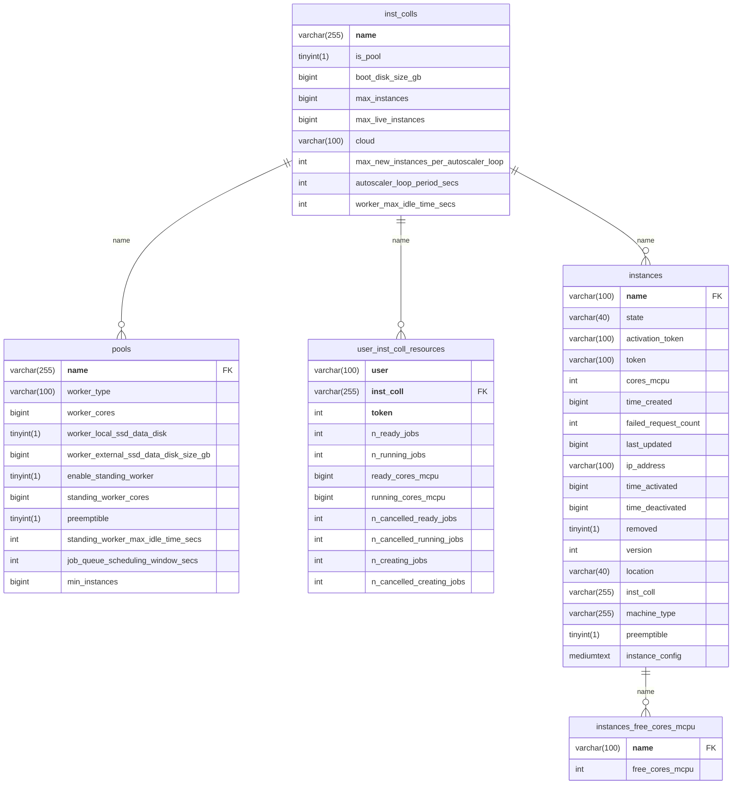

# Batch Database UML Diagram - Instances

```mermaid
---
config:
  layout: dagre
---
erDiagram
direction TB

	%% For future editors: I encourage you to try and find a way to make this Mermaid diagram more organized.
	%% It is, as of now, a task beyond my capabilities.

	inst_colls {
		varchar(255) **name** ""
		tinyint(1) is_pool  ""
		bigint boot_disk_size_gb  ""
		bigint max_instances  ""
		bigint max_live_instances  ""
		varchar(100) cloud  ""
		int max_new_instances_per_autoscaler_loop  ""
		int autoscaler_loop_period_secs  ""
		int worker_max_idle_time_secs  ""
	}
	pools {
		varchar(255) **name** FK ""
		varchar(100) worker_type  ""
		bigint worker_cores  ""
		tinyint(1) worker_local_ssd_data_disk  ""
		bigint worker_external_ssd_data_disk_size_gb  ""
		tinyint(1) enable_standing_worker  ""
		bigint standing_worker_cores  ""
		tinyint(1) preemptible  ""
		int standing_worker_max_idle_time_secs  ""
		int job_queue_scheduling_window_secs  ""
		bigint min_instances  ""
	}
	user_inst_coll_resources {
		varchar(100) **user** ""
		varchar(255) **inst_coll** "FK"
		int **token** ""
		int n_ready_jobs  ""
		int n_running_jobs  ""
		bigint ready_cores_mcpu  ""
		bigint running_cores_mcpu  ""
		int n_cancelled_ready_jobs  ""
		int n_cancelled_running_jobs  ""
		int n_creating_jobs  ""
		int n_cancelled_creating_jobs  ""
	}
	instances {
		varchar(100) **name** FK ""
		varchar(40) state  ""
		varchar(100) activation_token  ""
		varchar(100) token  ""
		int cores_mcpu  ""
		bigint time_created  ""
		int failed_request_count  ""
		bigint last_updated  ""
		varchar(100) ip_address  ""
		bigint time_activated  ""
		bigint time_deactivated  ""
		tinyint(1) removed  ""
		int version  ""
		varchar(40) location  ""
		varchar(255) inst_coll  ""
		varchar(255) machine_type  ""
		tinyint(1) preemptible  ""
		mediumtext instance_config  ""
	}
	instances_free_cores_mcpu {
		varchar(100) **name** FK ""
		int free_cores_mcpu  ""
	}


	%% Links to inst_colls:

	%% Links to instances_free_cores_mcpu:
	instances||--o{instances_free_cores_mcpu:"name"

	%% Links to instances:
	inst_colls ||--o{ instances:"name"

	%% Links to pools:
	inst_colls ||--o{ pools:"name"

	%% Links to user_inst_coll_resources:
	inst_colls ||--o{ user_inst_coll_resources:"name"
```
