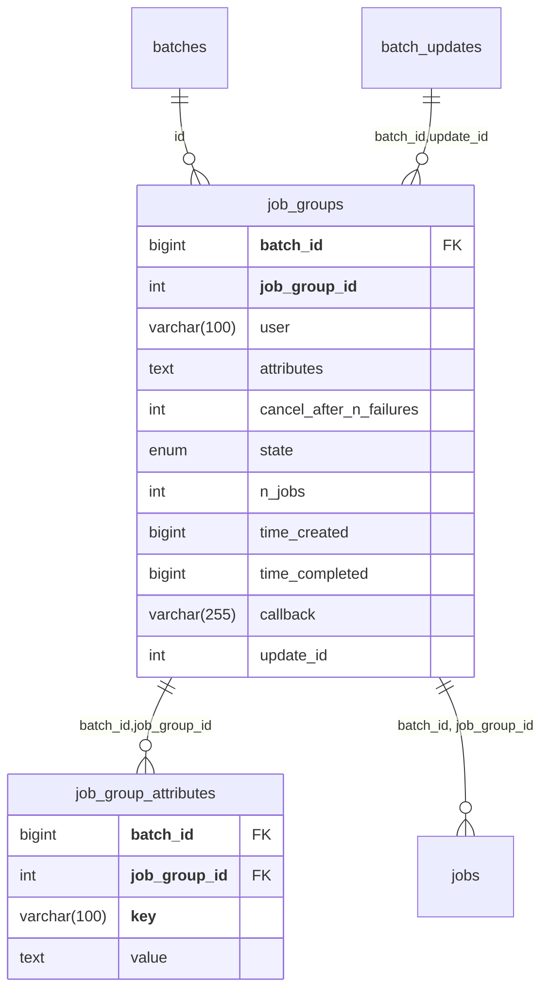

# Batch Database UML Diagram - Job Groups

```mermaid
---
config:
  layout: dagre
---
erDiagram
direction TB

	%% For future editors: I encourage you to try and find a way to make this Mermaid diagram more organized.
	%% It is, as of now, a task beyond my capabilities.


	job_group_attributes {
		bigint **batch_id** FK ""
		int **job_group_id** FK ""
		varchar(100) **key**  ""
		text value  ""

	}
	job_groups {
		bigint **batch_id** FK ""
		int **job_group_id** ""
		varchar(100) user  ""
		text attributes  ""
		int cancel_after_n_failures  ""
		enum state  ""
		int n_jobs  ""
		bigint time_created  ""
		bigint time_completed  ""
		varchar(255) callback  ""
		int update_id  ""
	}

	%% Links to job_groups:
	batches||--o{job_groups:"id"
	batch_updates ||--o{job_groups:"batch_id,update_id"

	%% Links to job_group_attributes:
	job_groups||--o{job_group_attributes:"batch_id,job_group_id"

	%% Links to jobs:
	job_groups ||--o{ jobs : "batch_id, job_group_id"
```
