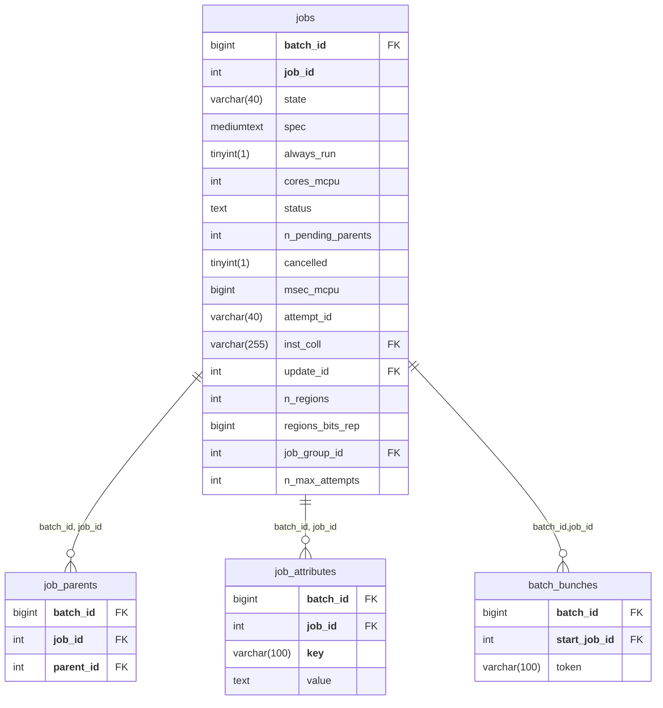

# Batch Database UML Diagram - Jobs

```mermaid
---
config:
  layout: dagre
---
erDiagram
direction TB

	jobs {
		bigint **batch_id** FK ""
		int **job_id** ""
		varchar(40) state  ""
		mediumtext spec  ""
		tinyint(1) always_run  ""
		int cores_mcpu  ""
		text status  ""
		int n_pending_parents  ""
		tinyint(1) cancelled  ""
		bigint msec_mcpu  ""
		varchar(40) attempt_id  ""
		varchar(255) inst_coll FK ""
		int update_id FK ""
		int n_regions  ""
		bigint regions_bits_rep  ""
		int job_group_id FK ""
		int n_max_attempts  ""
	}
	job_parents {
		bigint **batch_id** FK ""
		int **job_id** FK ""
		int **parent_id** FK ""
	}
	job_attributes {
		bigint **batch_id** FK ""
		int **job_id** FK ""
		varchar(100) **key** ""
		text value  ""
	}
	batch_bunches {
		bigint **batch_id** FK ""
		int **start_job_id** FK ""
		varchar(100) token  ""
	}

	%% Links to job_parents:
	jobs||--o{job_parents:"batch_id, job_id"

	%% Links to job_attributes:
	jobs||--o{job_attributes:"batch_id, job_id"

	jobs||--o{batch_bunches:"batch_id,job_id"
```
