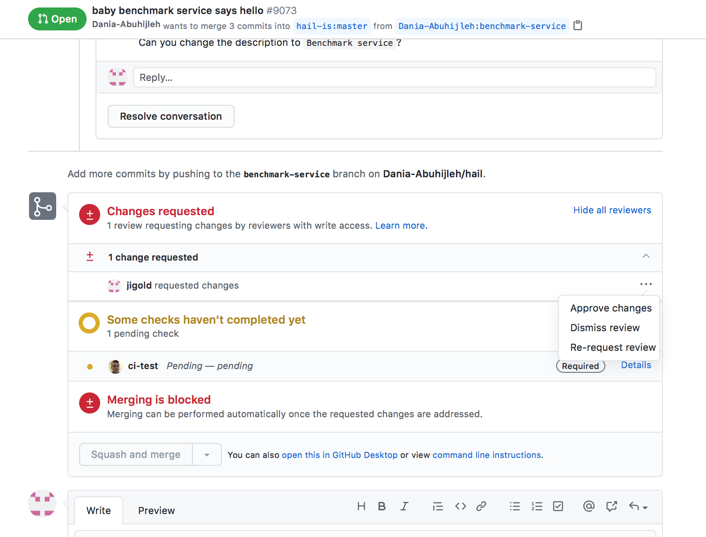

# Hail Development Process

The lifecycle of a new contribution to the Hail code base consists of the
following steps:  designing the feature, implementing changes, creating a PR,
reviewing a PR, approving and merging the PR, deploying the changes, and then
making periodic releases for users.


## Design

New features can either be bug fixes that users run into, small feature improvements, or larger,
more complicated features. For larger projects, write an
[RFC](https://github.com/hail-is/hail-rfcs), get a review, and merge it into the hail-rfcs
repository before working on a PR to the main Hail repository. We use this process as a chance to
refine the design as well as educate the rest of the team on proposed changes. It helps to have
multiple eyes thinking about what the implications of the changes are to the rest of the system. In
addition, we use this time to think about how to break down the feature into smaller, more
manageable chunks. Ideally, branches should contain up to 200 lines of changes to make the process
easier on the reviewer. It may not always be possible to break up a feature into smaller components.


## Implementation

### Environment / Tooling
Before you can write code, there are some setup steps that will allow you to
develop effectively.

Hail currently supports Python version 3.9 or greater.

Install the python dependencies of every Hail sub-project (e.g. ci, batch, hail/python/hailtop):

```bash
make install-dev-requirements
```

Install the pre-commit hooks:

```bash
pre-commit install --install-hooks
```

This creates git hooks that run certain linting checks, pyright on some sub-projects, and
auto-formatting on changed files every commit. For example, services code uses the [Black python
formatter](https://black.readthedocs.io/en/stable/) to enforce PEP8 compliance.

Sometimes large formatting or refactoring commits can muddle the git history
for a file. If your change is one of these, follow up by adding the commit SHA to
`.git-blame-ignore-revs`. To configure `git blame` to ignore these commits, run

```bash
git config blame.ignoreRevsFile $HAIL/.git-blame-ignore-revs
```

#### Services

Install and configure tools necessary for working on the Hail Services:

1. Install [Docker](https://docker.com)
2. Install [`kubectl`](https://kubernetes.io/docs/tasks/tools/install-kubectl/), if not already installed. (To test installation, run `kubectl` in a terminal window)
3. Install [`gcloud`](https://cloud.google.com/sdk/docs/install)
4. Configure gcloud and Docker for Hail:
```bash
gcloud auth login
gcloud config set project hail-vdc
gcloud container clusters get-credentials vdc --zone=us-central1-a
gcloud auth -q configure-docker $REGION-docker.pkg.dev
```

5. Add these lines to `~/.zshrc` or `~/.bashrc` to configure your shell and environment for
   Hail. `functions.sh` contains shell commands for working with the Kubernetes cluster.

```
export HAIL=/path/to/hail-repository
# BuildKit, a fast docker backend
export DOCKER_BUILDKIT=1
# Shell utilities for managing the Hail kubernetes cluster
source $HAIL/devbin/functions.sh
```

6. Run `brew install fswatch`

### Testing / Debugging
There are different strategies for debugging depending on whether you are
working on a compiler project or a services project.

#### Compiler

For a compiler project, you can build and run the tests locally on your
computer. To build hail for development purposes, you should run the following
command from the repository root.

```bash
make -C hail install-editable
```

Run the Scala query compiler tests:

```bash
make -C hail jvm-test
```

Run the Scala file system tests:

```bash
make -C hail fs-jvm-test
```

Note that the file system tests depend on remote test resources which are automatically cleaned up
after 1 day. To force re-upload of these remote test resources delete
`hail/upload-remote-test-resources`.

Run the Python query tests using the Spark backend in local mode:

```bash
make -C hail pytest
```

Run the Python query tests [matching a pattern](https://docs.pytest.org/en/7.1.x/reference/reference.html#command-line-flags):

```bash
make -C hail pytest PYTEST_ARGS='-k service_backend'
```

Run the Python query tests [in a particular
file](https://docs.pytest.org/en/7.1.x/reference/reference.html#command-line-flags) (relative to the
`hail/python` directory):

```bash
make -C hail pytest PYTEST_TARGET=test/hail/table/test_table.py
```

Run the Python copy tool and sync tool tests which test transfers of data between GCS, S3, ABS, and
your laptop's filesystem:

```bash
make -C hail pytest-inter-cloud
```

Again, note that these depend on remote resources that are auto-cleaned up. See the above comment
about deleting `hail/upload-remote-test-resources`.

Run the Python query tests using the Batch backend and a production instance of Hail Batch
(https://batch.hail.is or https://batch.azure.hail.is depending on your dev config):

```bash
make -C hail pytest-qob NAMESPACE=default
```

Run the Python query documentation tests:

```bash
make -C hail doctest-query
```

#### Services

Production, test and development versions of Hail Batch share one Kubernetes
cluster, but are able to coexist without interference because they are isolated
in different [namespaces](https://kubernetes.io/docs/tasks/administer-cluster/namespaces-walkthrough/).
The different kinds of namespaces are:

- The `default` or production namespace.
- Test namespaces. These are ephemeral namespaces used to test PRs. Every CI
  pipeline for a PR creates a namespace and deletes it when the tests finish.
- Dev namespaces. These are long-lived namespaces for developing new features.
  Each developer has their own namespace. It's name is the same as the developer's
  hail username.

For a services project, you can push your branch to GitHub and then run what we
call a “dev deploy”. The command to invoke a dev deploy is

```bash
HAIL_DEFAULT_NAMESPACE=default hailctl dev deploy -b <github_user_name>/hail:<branch_name> -s <step1>,<step2>,...
```

Dev deploy creates a batch that deploys the build steps specified by the `-s` in
your Kubernetes dev namespace. For example, if we want to test
whether the Batch tests still pass, we would specify -s test_batch. This will
run all the dependent steps for testing Batch such as creating credentials,
a live Auth service, a MySQL database for Batch, and a live Batch deployment.

Submitting a dev deploy with hailctl will give you the link to a UI
where you can monitor the progress of everything deploying and get the logs for
any steps that fail. You can also see a recent history of your dev deploys at
[ci.hail.is/me](https://ci.hail.is/me).

The first time a namespace is used, the Auth service in that namespace won't
have any users. In order submit jobs to the namespace, make sure to include
the `add_developers` step to the dev deploy. So a first dev deploy might look like:

```bash
HAIL_DEFAULT_NAMESPACE=default hailctl dev deploy -b <github_user_name>/hail:<branch_name> -s deploy_batch,add_developers
```

After this dev deploy completes, you should be able to access your namespace
by navigating to https://internal.hail.is/<username>/batch.

The service accounts used in developer namespaces do not have permission to create pet service accounts in the
`hail-vdc` project, so the gsa-key secrets for these must be copied across from the default namespace in order
to run real jobs on the developer namespaces' batch services:
```bash
$ download-secret <username>-gsa-key
$ kubectl create secret generic <username>-gsa-key --namespace=<username> --from-file=contents/key.json
$ cd - # Return to your original directory
```

To submit jobs to your dev namespace, you need to configure your local hail
installation to point to the dev namespace. You can do this by running

```bash
hailctl dev config set default_namespace <my_namespace>
hailctl auth login
```
Then, any Hail Batch or Query-on-Batch script will submit to your dev namespace.

You can also use the `HAIL_DEFAULT_NAMESPACE` environment variable to alter
the namespace for individual terminal sessions or commands.

NOTE: The dev deploy command above sets `HAIL_DEFAULT_NAMESPACE=default`. That's
because `hailctl dev deploy` submits a request to the production CI service that
lives in the `default` namespace. This does *not* mean that your branch will be deployed
to the `default` namespace, it will always be deployed into your dev namespace.

To examine the Kubernetes logs for the service in your namespace, use something like

```bash
kubectl -n <my_namespace> logs -l app=batch-driver --tail=999999 | less
```

To check the MySQL database in your namespace, you can log in to the database
pod like so:

```
kubectl -n <my_namespace> exec -it db-0 /bin/bash
$ mysql
```

##### Alternatives to dev deploy

There are three ways to deploy code into a dev namespace:
1. dev deploy
2. make deploy
3. sync.py

These are listed in order of broadest scope to narrowest scope, so it is never
wrong to do something higher on the list, but it might be a slower feedback loop.

A dev deploy is necessary under the following conditions:
- A dev namespace has not been used before
- You have added a migration that must be run against a service's database
- Not all necessary services (like Auth) are deployed in the namespace and you
  do not want to `make` deploy them individually.

If you just want to redeploy a single service, you can do so with the following:

```bash
make -C batch deploy NAMESPACE=<my_namespace>
```

If you only want to make a Python code change to an already-running service
in Kubernetes, you can run `devbin/sync.py` like the following:

```bash
python3 devbin/sync.py \
    --namespace <my_namespace> \
    --app batch --app batch-driver \
    --path batch/batch /opt/venv/lib/python3.11/site-packages/ \
    --path gear/gear /opt/venv/lib/python3.11/site-packages/ \
    --path web_common/web_common /opt/venv/lib/python3.11/site-packages/ \
    --path hail/python/hailtop /opt/venv/lib/python3.11/site-packages/
```

This will create a long-running process that watches the files in the `batch`
and `gear` modules. When changes to those files are saved it will upload those
changes to currently running pods in the namespace and restart those pods. Note
that Batch Workers are not running as pods in Kubernetes, and are immutable. So
if you want to update code running on a Batch Worker, you will need to `make`
deploy and then delete existing workers in your namespace.

## PR

Once you have a branch that you are happy with, then you create a Pull Request
on the GitHub UI. For an overview of our practices around git and pull requests,
see [this doc](git-practices.md)

Set a reviewer in the "Assignees" box. Do *not* use the "Reviewers" box. Our CI system specifically
uses the "Assignees" box to list a developer's pending reviews at https://ci.hail.is/me. If you are
an outside contributor and cannot request reviews, you can have CI automatically assign a
reviewer. By writing `#assign services` or `#assign compiler` in the PR body, CI will randomly
select a collaborator on the relevant team and assign them for you.

You can also give the PR a set of labels. The important ones are “WIP” to make
sure the pull request doesn’t get merged accidentally until you are ready,
“migration” to warn everyone that the changes will shut down the Batch
deployment if it requires a database migration, “bug” for bug fixes, “breaking
change” for any user breaking changes for Hail Query, and “prio:high” to make
this PR the first one in line to merge. There’s also “stacked PR” to indicate
that the changes in the PR are dependent on the changes in another PR. You
should reference that PR in your commit message with “Stacked on #9883”. Most
PRs will not have any labels.

For the PR title, start the title with the name of the service(s) the changes
impact. For example, if it’s a Benchmark change, then you’d write
`[benchmark]`. If it’s a Hail Query change, then it would be `[query]`. We also want
the title to be descriptive enough to know what the change is without being too
verbose. An example is “`[batch]` Added read_only option for gcsfuse”.

For the PR commit message, we want the message to be descriptive of the complete
set of changes that occurred, especially if it’s a complicated set of
changes. If it’s a smaller, obvious change like a one-liner, then it’s okay to
omit the commit message. For UI changes, it’s helpful to paste a screenshot of
the changes. It’s also a good idea to comment on how you tested the changes and
whether there are any implications of your changes. If the PR fixes a bug that
is a GitHub issue, then you can say “Fixes #8900” to make sure the issue gets
automatically closed by GitHub when your PR is merged. You can also tag a
specific member of the team in the message to get their attention with “@user”.

If the changes are user-facing, then add a line in your commit message that
starts with “CHANGELOG: description.”. This should be one line with one sentence
that ends in a period.

Once you are done with writing up all the details of the Pull Request, you can
then submit it. Our continuous integration (CI) system watches for new PRs. When
it sees a new PR, it creates a new batch that will test everything defined in
the build.yaml file in the root of the repository. This will create a temporary
namespace in kubernetes for your PR and deploy all the services into it. It will
also run all the tests such as for query, batch, and ci after merging it with
the latest version of main. You can view the progress of the build and the
logs for your PR at [ci.hail.is](https://ci.hail.is).


## Review

Once the PR has been created, it is the responsibility of the reviewer(s) to
review the PR. Our goal as a team is to give comments within 24 hours. To review
someone else’s changes, click on “Files changed”. This will show the diff
between the old code and the new proposed changes. You can make comments on
specific lines of the code. Feel free to ask questions here, especially if you
don’t understand something! It’s a good idea to think critically about the
changes. There should also be tests either added or existing to make sure the
code changes do not break any existing functionality and actually implement what
was intended. For example, a change to test whether Batch doesn’t crash when a
user gives a bad input should have a test with bad inputs. It’s okay to spend a
lot of time reviewing PRs! This is a critical part of our development process to
avoid bugs and unintentional breaking changes. If there are items for the
developer to address, then submit your review with “Request Changes”. Otherwise,
once you are happy with the changes and all comments have been addressed, you
can “Approve” the PR.

If you are the person whose code is being reviewed and your PR is in the Request
Changes state, then you’ll need to address their comments by pushing new commit
changes or answering questions. Once you are done, then you can re-request a review
in the "Reviewers" box.

If your review is requested on a PR submitted by an outside contributor, you should
"assign" yourself or the appropriate team member to the PR. The assignee is
responsible for ensuring that the PR does not go stale and is eventually
merged or closed.




## Merge / Deploy

Once a PR has been approved, our continuous integration service (CI) will squash
merge the commits in the PR into the main branch of the repository. This will
then trigger a deploy batch. The deploy batch will first deploy all of the new
Docker images, redeploy the running services in the default namespace with the
latest changes, and rerun all of the tests with the new version of main
incorporating your changes.

If this batch fails, a Zulip message will be sent to the entire team linking to the UI for the
failing batch. We should never ignore this message. We should figure out what component broke. If
it’s a transient error, then we need to harden our retry strategy.

The `build.yaml` file describes how to build and deploy each commit of Hail. Steps with kind
`createDatabase2` create or migrate databases. A database is a collection of tables. A migration can
be "offline," the default, or "online". For the last couple years, we have not used offline
migrations because Batch must be available 24/7 for the scientists.

When CI runs an offline migration, it shuts down the services listed in "shutdowns" before running
the migration. You can check which migrations have complete by connecting to the admin-pod:

```bash
kssh admin-pod
```

Starting mysql and looking at the `NAME_migration_version` and `NAME_migrations` tables:

```bash
mysql
use NAME
select * from NAME_migrations
select * from NAME_migration_version
```

When the migration is complete **you must manually** deploy the service:

```bash
make -c batch deploy
```

## Release

Changes to the services are immediately deployed to the production cluster. Changes to the Hail
Python library are disseminated via PyPI. When a main commit changes the Hail "Python version", CI
will run the release steps. Changes to the Python version should be done by a PR whose title is
"[release] 0.2.XXX", which changes the Python version in both `hail/version.mk` and `hail/build.sc`,
and which updates the Batch and Query change logs: `hail/python/hail/docs/change_log.md`
`hail/python/hailtop/batch/docs/change_log.rst`. The change logs should comprise all the
`CHANGELOG:` lines from commits between the last release and the new release, for example:

```
git log 0.2.127..HEAD
```

CI will create a git tag, a GitHub release, a PyPI package version, update the public Hail docs. We
aim to release once per month. Note that our wheels are limited to 200 MiB and the sum total size of
all published PyPI wheels must be less than 20 GiB. Check [the current limits at
PyPI](https://pypi.org/manage/project/hail/settings/). We had to [request a size
increase](https://github.com/pypi/support/issues/2857) in 2023.
