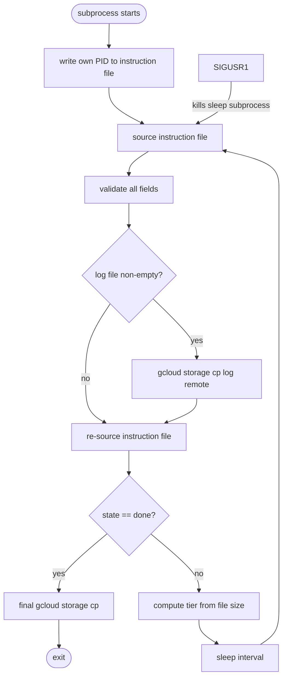
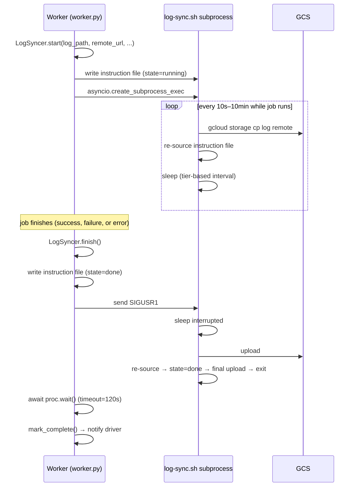
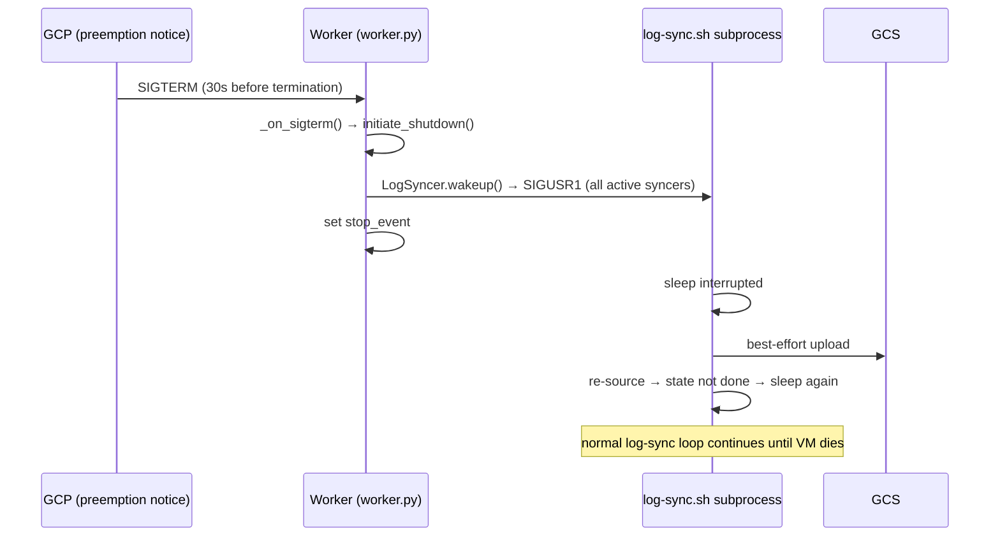

# Persistent Logs for Preempted Jobs

## Problem

Job logs are currently uploaded to GCS once, at the end of execution, inside the `on_completion`
callback (Docker jobs) or `cleanup()` (JVM jobs). If a worker VM is preempted before that point,
the logs are lost. The driver detects the dead VM, reschedules the job with a new attempt ID,
and the retry starts with no log evidence from the previous attempt.

## Solution

Each job's main container starts a dedicated bash subprocess (`log-sync.sh`) that incrementally
uploads the log file to GCS on a size-tiered schedule. If the VM is preempted, the most recently
uploaded snapshot survives. When the job finishes normally, the worker writes `state=done` to an
instruction file and sends `SIGUSR1`; the subprocess does a final upload and exits cleanly.

The instruction file is the sole coordination channel — no IPC sockets, no shared in-process state.

Controlled by the `continuous_log_sync` feature flag (default: `true`). When disabled, the
original single end-of-job upload behaviour is preserved.

## Files

- **`batch/log-sync.sh`** — the sync subprocess script, shipped in the worker image at
  `/usr/local/bin/log-sync.sh`
- **`batch/batch/worker/worker.py`** — `LogSyncer` class + wiring in `DockerJob.run_container()`
  and `JVMJob.run()` / `JVMJob.cleanup()`
- **`batch/batch/front_end/front_end.py`** — `_get_job_container_log()` feature-flagged GCS path
- **`batch/batch/driver/main.py`** — feature flag storage, activate response
- **`batch/sql/121-add-continuous-log-sync-flag.sql`** — migration adding the flag column

## Feature Flag Architecture

The `continuous_log_sync` flag is stored in the `feature_flags` MySQL table and toggled from the
batch-driver admin page. It propagates in two directions:

1. **Front-ends** read all feature flags at startup only (`on_startup`). Changing the flag requires
   restarting the front-end pods to take effect; there is no runtime refresh.
2. **Workers** receive the flag in the activate HTTP response body:
   ```python
   # driver/main.py activate handler
   return json_response({'token': token, 'feature_flags': dict(request.app['feature_flags'])})
   ```
   The worker reads it once on activation and caches it in the module-level `CONTINUOUS_LOG_SYNC`
   bool. Changing the flag takes effect for newly activated workers; existing workers keep their
   cached value until they restart.

To revert entirely: uncheck `continuous_log_sync` in the batch-driver UI, then restart the
front-end pods. Workers switch on their next activation (VM restart or re-register).

## Instruction File

Written by the worker to `/run/batch-worker/log-sync/<batch_id>_<job_id>_<attempt_id>.conf`
before the subprocess starts. This directory is outside the job scratch space; the user cannot
access or tamper with it.

```bash
log=/batch/<token>/main/container.log
remote=gs://bucket/logs/batch/1/1/<attempt_id>/main/log
state=running
pid=
interval=10
small_limit=10240
small_interval=30
medium_limit=5242880
medium_interval=60
large_limit=10485760
large_interval=300
xlarge_limit=52428800
xlarge_interval=600
```

The subprocess fills in `pid=` on startup via `sed -i`. When `finish()` is called, the worker
rewrites the entire instruction file atomically (tmp file + `os.replace`) with `state=done` and
`pid=` reset to empty, then sends SIGUSR1. The subprocess re-sources, sees `state=done`, and exits
— it does not need to re-read `pid=` at that point.

## Sync Intervals (Size-Tiered)

| Tier   | Condition        | Interval |
|--------|------------------|----------|
| tiny   | < 10 KB          | 10 s     |
| small  | 10 KB – 5 MB     | 30 s     |
| medium | 5 MB – 10 MB     | 60 s     |
| large  | 10 MB – 50 MB    | 5 min    |
| xlarge | > 50 MB          | 10 min   |

The 10 KB threshold for the tiny tier means that most jobs producing any meaningful output move
into the 30s tier within the first few upload cycles. Jobs that remain under 10 KB for their
entire lifetime (quiet long-running jobs) stay in the tiny tier throughout. This keeps GCS Class A
write operation costs reasonable at scale.

Implied bandwidth at each tier:
- tiny: up to 10 KB / 10 s = 1 KB/s
- small: up to 5 MB / 30 s ≈ 171 KB/s
- medium: up to 10 MB / 60 s ≈ 171 KB/s
- large: up to 50 MB / 300 s ≈ 171 KB/s
- xlarge: unbounded / 600 s — best-effort for very large logs

## Subprocess Loop



The re-source after each upload (before the sleep/done-check) is the key to correct termination
behaviour — see [Race Conditions](#race-conditions) below.

## Worker Lifecycle (Normal Completion)



## Worker Lifecycle (Preemption)



SIGTERM gives 30 seconds before termination. `initiate_shutdown()` wakes all active syncers so
they upload immediately rather than waiting for the current sleep to expire. There is no clean
`state=done` written — the syncer continues its normal loop and is killed when the VM is terminated.

The same `initiate_shutdown()` is called when the operator clicks "Stop" in the UI (`Worker.kill()`),
ensuring active syncers are also woken on manual stop.

## LogSyncer Class

```python
# Key interface:
class LogSyncer:
    @classmethod
    async def start(cls, log_path, remote_url, batch_id, job_id, attempt_id) -> 'LogSyncer'
    async def finish(self) -> None   # write state=done, send SIGUSR1, await with 120s timeout
    async def cancel(self) -> None   # kill subprocess immediately (no final upload)
    def wakeup(self) -> None         # send SIGUSR1 without marking done (used by initiate_shutdown)
```

`start()` registers the syncer in `_active_log_syncers` (module-level set).
`finish()` and `cancel()` discard from the registry.

## Front-End Log Path

When `continuous_log_sync` is enabled (and `CLOUD == 'gcp'`), the log endpoint goes directly to
GCS for all states — running, preempted, or completed:

```python
# front_end.py _get_job_container_log()
if app['feature_flags']['continuous_log_sync'] and CLOUD == 'gcp':
    attempt_id = override_attempt_id or attempt_id_from_spec(job_record)
    if attempt_id is None:
        return None   # job never started (no attempt assigned yet)
    return await _read_job_container_log_from_cloud_storage(...)
```

A GCS 404 (no log file yet) is caught by `_read_job_container_log_from_cloud_storage` and
returned as `b'ERROR: could not find log file'`.

The legacy path (proxy live logs from the worker while Running, GCS otherwise) is preserved when
the flag is disabled or on non-GCP clouds.

## GCP-Only Guard

`LogSyncer` is only started when `CLOUD == 'gcp' and CONTINUOUS_LOG_SYNC`. Non-GCP deployments
fall back to the existing single end-of-job upload. The `gcloud storage cp` command used by the
subprocess is GCP-specific.

## Race Conditions

### Covered

**1. SIGUSR1 arrives while gcloud cp is running, or in the window between the post-upload re-source
and the sleep start.**

Bash trap handlers fire between commands. If `finish()` sends SIGUSR1 while the subprocess is
inside `gcloud storage cp`, the signal is queued and fires between commands rather than interrupting
the upload. After `gcloud` returns, the subprocess re-sources (`state=done`), does the final
upload, and exits.

A subtler race: SIGUSR1 fires *after* the post-upload re-source (which saw `state=running`) but
*before* `SLEEP_PID` is set — so `wakeup()` is a no-op and the subprocess would otherwise sleep a
full tier interval before detecting `state=done`. This is closed by a second re-source immediately
before the `sleep` command. The remaining window (between the pre-sleep re-source and the actual
`sleep` syscall) is microseconds.

**2. Bytes written to the log after the upload-start but before the container exits.**

When `finish()` is called, it first writes `state=done` then sends SIGUSR1. The signal wakes the
sleep and the subprocess runs a full upload cycle: upload #N (which may be slightly stale if the
container was still writing), then re-sources and detects `state=done`, then does a **final upload
#N+1** capturing any bytes written since upload #N started, then exits. This double-upload on
termination is intentional and closes the window.

**3. Transient gcloud failure.**

`gcloud storage cp` is run with `|| echo "$PREFIX upload failed, will retry next cycle"` rather
than relying on `set -euo pipefail` to exit the script. A transient network error or GCS hiccup
skips the upload for one cycle but the subprocess continues and retries on the next iteration.

**4. SIGTERM (preemption) while a long sleep is running.**

`initiate_shutdown()` calls `LogSyncer.wakeup()` on all active syncers, sending SIGUSR1 which
kills the background `sleep` subprocess. The syncer immediately runs an upload and re-sources
before sleeping again. For most tiers (tiny through large) this means a fresh upload is in flight
within seconds of the preemption notice.

### Not Fully Covered

**5. Very large files (>50 MB, xlarge tier) during preemption.**

The xlarge tier sleeps 10 minutes between uploads. On SIGTERM, `wakeup()` interrupts the sleep
and starts an upload — but uploading a multi-gigabyte log file within the 30s preemption window
is not guaranteed. The GCS object from the last completed upload cycle survives; the bytes written
since then may be lost. This is best-effort.

**6. gcloud cp still running when SIGTERM fires and 30s window expires, or when finish() times out.**

If the VM is terminated while `gcloud storage cp` is in mid-flight, the upload is aborted. The
previous completed upload is still intact.

If `finish()` times out (120 s) waiting for the syncer, it sends SIGKILL to the bash process but
does not kill `gcloud storage cp` (a grandchild in the same process group). The orphaned gcloud
process continues its upload and exits on its own; the GCS object is overwritten after cleanup has
started. This is best-effort — in practice 120 s is sufficient for all but the largest logs on
slow connections.

**7. Multiple rapid re-preemptions.**

If a job is preempted, rescheduled, and preempted again before completing a full sync cycle, the
log from each attempt is independently uploaded up to the last completed sync. Each attempt gets
its own GCS path keyed by `attempt_id`, so logs from different attempts do not overwrite each other.

## Cost

- **Network (GCE → GCS, same region):** free; GCS egress within the same region is not charged.
- **Write operations:** ~$0.000005 per `gcloud storage cp` (Class A write). Negligible at any
  realistic job scale. The 10 KB tiny-tier threshold ensures most jobs spend their time in the
  30s+ tiers rather than the 10s tier, keeping operation counts low.
- **Storage:** each sync overwrites the same GCS object (same path, same attempt_id), so storage
  cost is proportional to current log size, not number of uploads.

## Container State Edge Cases

If a container is in `pending` or `creating` state when `on_completion` fires (i.e. it was deleted
before it started), `LogSyncer.cancel()` is called instead of `finish()` — the subprocess is killed
immediately with no final upload attempt, since there is no meaningful log to upload.
