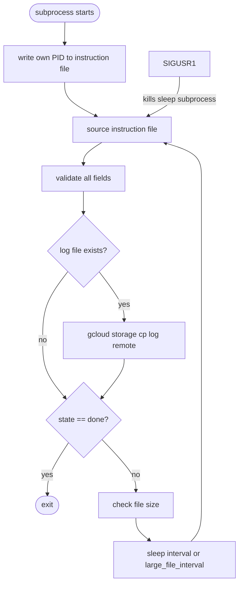
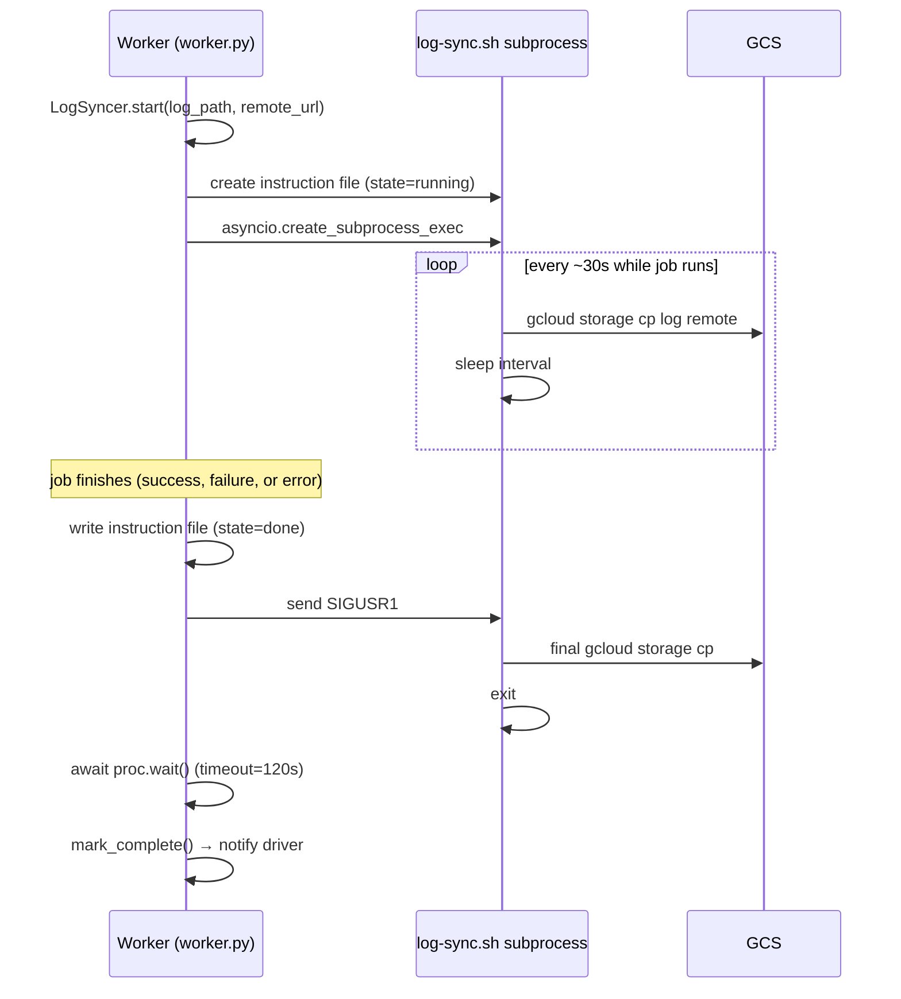
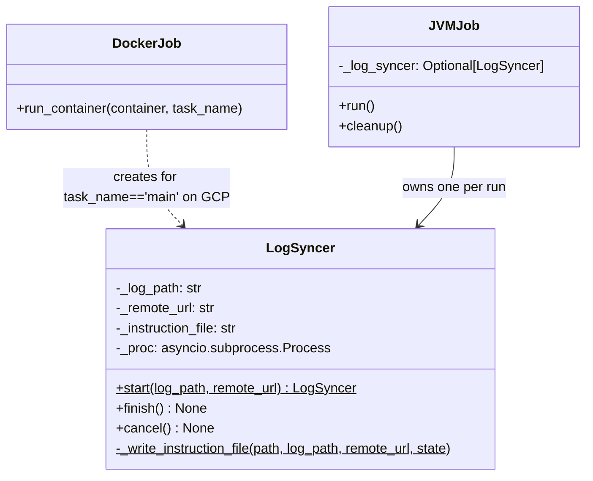

# Persistent Logs for Preempted Jobs

## Problem

Job logs are currently uploaded to GCS once, at the end of execution, inside the `on_completion`
callback (Docker jobs) or `cleanup()` (JVM jobs). If a worker VM is preempted before that point,
the logs are lost. The driver detects the dead VM, reschedules the job with a new attempt ID,
and the retry starts with no log evidence from the previous attempt.

## Solution

Each job's main container starts a dedicated bash subprocess (`log-sync.sh`) that incrementally
uploads the log file to GCS every 30 seconds. If the VM is preempted, the most recently uploaded
snapshot survives. When the job finishes normally, the worker writes `state=done` to an instruction
file and sends `SIGUSR1`; the subprocess does one final upload and exits cleanly.

The instruction file sitting alongside the log is the sole coordination channel — no IPC sockets,
no shared in-process state.

## Files

- **`batch/log-sync.sh`** — the sync subprocess script, shipped in the worker image at
  `/usr/local/bin/log-sync.sh`
- **`batch/batch/worker/worker.py`** — `LogSyncer` class + wiring in `DockerJob.run_container()`
  and `JVMJob.run()` / `JVMJob.cleanup()`

## Instruction File Format

Written by the worker to `<log_path>.sync` before the subprocess starts:

```bash
log=/batch/<token>/main/container.log
remote=gs://bucket/logs/batch/1/1/<attempt_id>/main/log
state=running
interval=30
large_file_limit=5242880
large_file_interval=120
pid=
```

The subprocess fills in `pid=` on startup. The worker overwrites `state=running` → `state=done`
atomically (tmp file + `os.replace`) when the job finishes.

## Subprocess Loop



`SIGUSR1` naturally respects "only interrupt if not uploading" because bash trap handlers fire
between commands, not during them. If the signal arrives during `gcloud storage cp`, it is queued
and fires at the start of the next sleep.

## Worker Lifecycle



## LogSyncer Class



## GCP-Only Guard

`LogSyncer` is only started when `CLOUD == 'gcp'`. The subprocess uses `gcloud storage cp` which
is GCP-specific. Non-GCP deployments fall back to the existing single end-of-job upload.

## Cost

- **Same-region (GCE → GCS):** network transfer is free; each `gcloud storage cp` re-uploads the
  full log file but there are no egress charges within the same region.
- **Cross-region:** each sync re-uploads the full file, so egress cost scales with
  `log_size × sync_count`. The large-file fallback interval (120s) reduces this for large logs.
  Keeping the log bucket co-located with worker regions eliminates cross-region traffic entirely.
- **Operation cost:** ~$0.000005 per upload (Class A write); negligible at any realistic job scale.

## Large File Behaviour

When the log file exceeds `large_file_limit` (5 MB), the subprocess switches from `interval` (30s)
to `large_file_interval` (120s). This reduces upload frequency for jobs producing large logs while
still providing reasonable freshness for the common case.

## Container State Edge Cases

If a container is in `pending` or `creating` state when `on_completion` fires (i.e. it was deleted
before it started), `LogSyncer.cancel()` is called instead of `finish()` — the subprocess is killed
immediately with no final upload attempt, since there is no log to upload.

## Signed URL Migration (Future)

Once logs are reliably in GCS for all attempts including preempted ones, the front_end log endpoint
can be simplified: generate a short-lived signed URL and redirect the client directly to GCS,
eliminating the current worker↔front_end log proxy path.

## Open Questions

- **Sync interval tuning:** 30s is the default; this can be made configurable via instance config
  without changing the script (just write a different value to the instruction file).
- **stderr from the subprocess:** currently discarded (`DEVNULL`). If debugging is needed, redirect
  to `<log_path>.sync.log` in the scratch directory.
- **Azure:** not applicable; Azure is being phased out.
