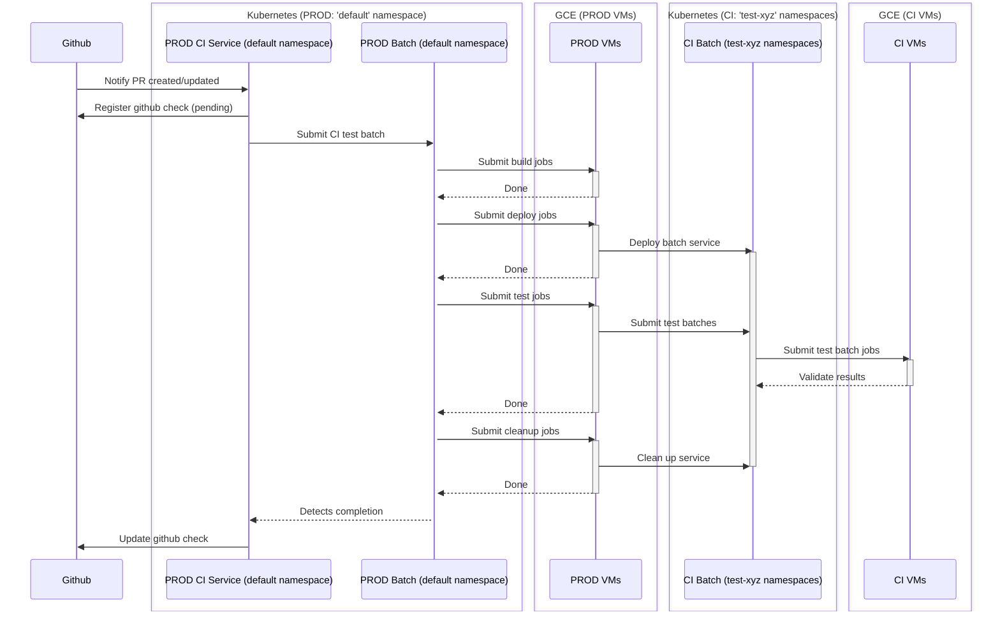
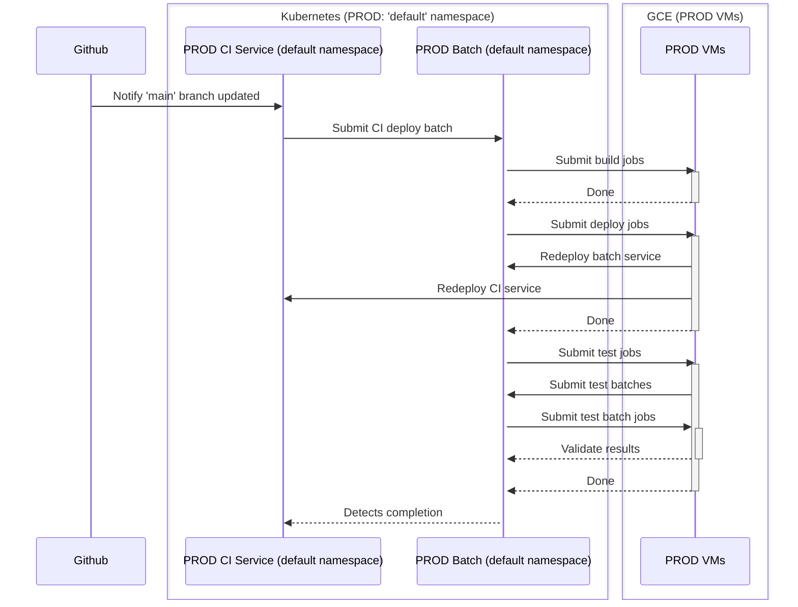
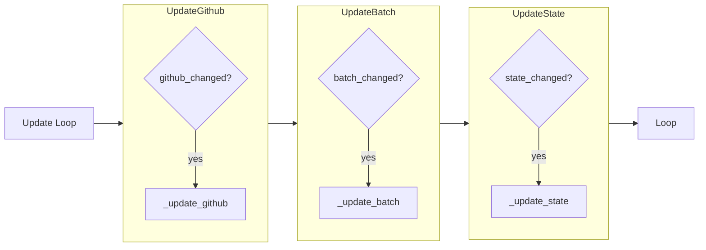
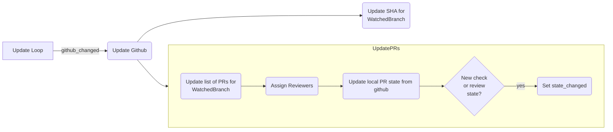
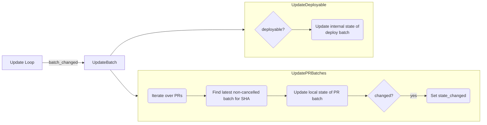
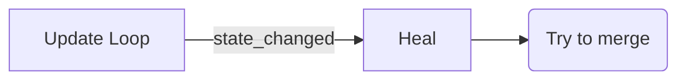
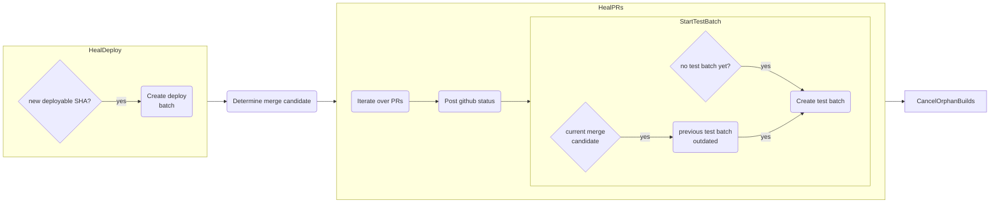
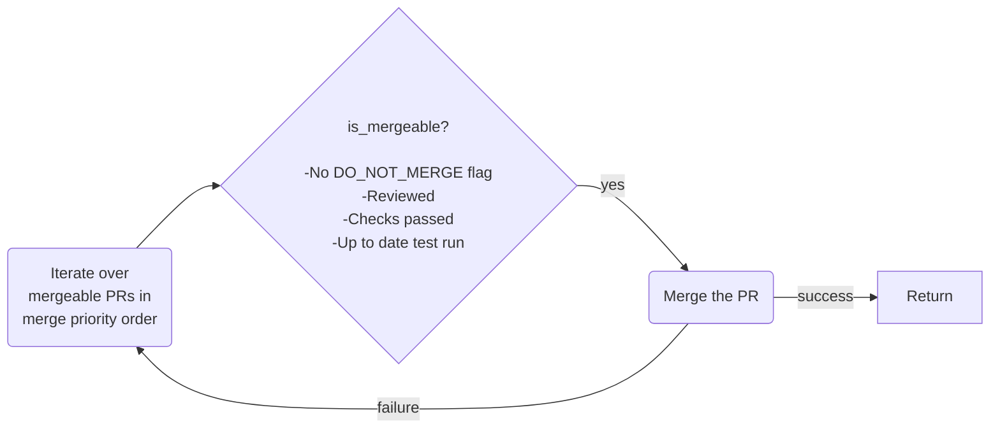

# The CI Service

## Documentation Scope

This documentation is trying to achieve two goals:

- How the CI service is structured and operates as a general purpose, customizable component
- How the CI service is configured and deployed by the Hail team:
  - From the `hail-is/hail:main` branch of the hail repository
  - To the `default` namespace of the Hail Batch cluster in GCP

The primary text of the document will focus on the first goal, documenting the general purpose component.

When describing how CI is configured and deployed by the Hail team, this will be clearly annotated. 
Note that the Hail team's configuration is mostly stable, but should be treated with a grain of salt and validated 
against the actual configuration instead of being assumed to be true.

## Overview of the CI Service

The CI service has three functional purposes:

- Runs tests against pull requests which target designated 'watched branches'
- Merges PRs onto watched branches when they are ready
- Deploys services to the live infrastructure when the watched branch is updated

## Structure and Operation

The CI service itself is deployed as a Kubernetes service in the Hail Batch cluster. See 
[architecture diagram](../Hail%20Batch%20Architectural%20Diagram.png).

CI must be configured with an access token allowing it to operate on 
behalf of a github account 

> [!NOTE]  
> This account is called `hail-ci-robot` in hail-is/hail.

### Watched Branches

One of the core concepts of the CI service is the "watched branch". A watched branch is a branch in a github repository
which the CI service is configured to monitor for changes. The CI service will run tests against PRs which target the
watched branch, will merge PRs against watched branches when they are ready, and will deploy services when the watched 
branch is updated.

> [!NOTE]  
> In `hail-is/hail`, there is one watched branch: `hail-is/hail:main`.

### Tracked State

For each branch, CI will track three types of state which can be marked as stale using appropriate flags:
- The state of github branches, commits, and PRs ("`github_changed`")
- The state of batches CI is running to run tests or deploy to production ("`batch_changed`")
- Whether CI needs to act externally, to update Github or start new batches ("`state_changed`")

### CI Update Loop

The core CI update loop iterates over its set of "watched branches". If any of the state flags for any of the watched
branches are marked as dirty, then the CI service will re-evaluate the state of the watched branch and potentially take
action to update either its own internal state or the state of github or the deployed system.

A set of detailed flowcharts detailing the CI update loop is given in the [references](#references) section below, which
can be cross-referenced against the purposes and outcomes of the CI service as described in the following text sections.

#### Detecting Stale State

##### Regular Polling

At a configurable frequency, the CI service will mark **_all_** flags for **_all_** watched branches as dirty, which
will trigger a re-evaluation of the system state.

##### Github Webhooks

To make CI more responsive it also has endpoints to receive webhook event triggers from the github repository. This endpoint
is part of the CI API, listening on `/github_callback`.

Depending on the type of webhook received, and the branch or PR which it is targeting, the CI service will
potentially dirty one or more of its watched branches' state flags, meaning that CI will prioritize re-evaluating
the state of the branch in question.

The webhooks themselves are configured manually within the github repository itself and not managed by terraform or deploy scripts.

> [!NOTE]  
> - For `hail-is/hail`, the webhook target is: `ci.hail.is/github_callback`
> - For `hail-is/hail`, webhook callbacks are configured to happen on changes to the following:
>   - Pull request reviews
>   - Pull requests
>   - Pushes

## Running tests against pull requests

When a PR which targets a watched branch is created, updated or closed, the `github_changed` flag will be marked as dirty. 

During its update loop, CI will potentially decide to run tests against all PRs targetting a watched branch:

- Authorization
  - If the author is in the [`ci/ci/constants`](../../../ci/ci/constants.py) list of known developers, it can be tested.
  - If the github SHA for the commit has been registered, it can be tested.
  - Otherwise, it will be ignored.
- Check for validity
  - The PR must be against a watched branch, or else it wouldn't be considered.
  - If the current commit has already had tests run against it, no further action is taken `*`
  - If the PR is marked with the "do_not_test" label, no further action is taken
- Run tests
  - The CI service will run tests against the PR (see below) 
  - Report results back to Github using the Checks interface

`*` Note: there is an important nuance to the statement "If the current commit has already had tests run against it, no further action is taken".

- Every time CI loops through its update cycle, it will determine a "merge candidate" from all of the PRs which are approved.
- If the batch tests for the merge candidate PR were run against a different SHA than the current SHA of the watched branch,
  then CI trigger a new test batch. 

### Running Tests

The process of running tests goes like:

- CI will create a pending Check against the PR in question
- CI will generate a new batch and submit it against the production Hail Batch service using its own service credentials
  - Tasks in the batch are defined in `build.yaml` in the top repo directory. CI generates jobs in the batch from the steps defined in there.
- The batch contains jobs which will:
  - Clone the appropriate branch
  - Squash and rebase onto `main`
    - This is done in a way that means the resulting SHA will match the SHA which would be produced when the PR merges.
  - Build new versions of all hail tools, packages and libraries
  - Build a new set of docker images for hail query and the updated services
  - Deploy the batch suite of k8s services into one of many CI-owned namespaces in the Hail Batch cluster
    - These namespaces are named like `"pr-<PR_NUMBER>-<CI-NAMESPACE>-<RANDOM>"`
    - Where `CI-NAMESPACE` is the namespace where CI is running (usually `default`). 
  - Run a series of tests against the services
  - Each test:
    - Submits a specially crafted batch to the newly deployed batch namespace
    - Checks that the results of running the batch are what we would expect
- The CI service polls the batch which it submits for overall success or failure.
- Once the batch has either succeeded or failed, CI uses that result to report status back to GitHub

Examples of CI test runs can be seen by searching through the production batch log, as long as you are a member
of the `ci` billing project. 

> [!NOTE]
> CI test runs in hail.is can be seen [here](https://batch.hail.is/batches?q=user+%3D+ci%0D%0Atest+%3D+1).
> Note:
> - You will need to be a member of the `ci` billing project to view these logs.
> - Due to the numbers of batches involved, this page may take a while to load 

#### CI Testing Timeline

The image below shows the CI testing timeline:

## Merging PRs

Mergability is determined by:

- All required checks must be successful
- There must have been a CI-generated test batch
  - The most recent test batch must have run against the current SHA of the watched branch 
- The PR must be approved
- The PR must not have the "DO_NOT_MERGE" label

The control flow from final approval to CI merging a PRs looks like:

- The PR's state will change in github (maybe a check changes to SUCCESS, or a review is approved)
- The github webhook callback will cause the `github_changed` flag to be marked as dirty for the target `WatchedBranch`
- CI will detect that this PR is now considered mergeable 
- CI will attempt to merge all PRs which are mergeable, in priority order
  - Note: as soon as one PR merges, the remaining branches will no longer be mergeable because the target SHA will have changed

## Deploying services to the live infrastructure

When a PR is merged into the `main` branch, a webhook will trigger. The CI service will set its `github_changed` flag.

During its update loop, the CI service will determine that the SHA of the `WatchedBranch` has changed and trigger
a deployment. Like in the test case, the CI service uses targets in `build.yaml` to generate a set of jobs in a
batch run:  

- Create a new batch job to:
  - Build various components and service images
  - Deploy to the `default` (ie prod) namespace
  - Run various post-deployment tests
  - A handful of final actions
    - eg rolling out artifact registry cleanup policies, amongst many other things

Note: It's not actually quite as waterfall-y as this. In fact the jobs are all running in a hail
batch, and each package being built and service being deployed has its own path through the DAG. So it's quite possible
that services are deploy/test-ing in parallel, and that the deploy and test jobs for one service might all complete before 
the deploy and test for another have even started.

This should all be fine. Because we only merge in the first place if the PR in question has already passed
tests against the current SHA of the watched branch.

> [!NOTE]
> CI deploy runs in hail.is can be seen [here](https://batch.hail.is/batches?q=user+%3D+ci%0D%0Adeploy+%3D+1).
> Note:
> - You will need to be a member of the `ci` billing project to view these logs.
> - Due to the numbers of batches involved, this page may take a while to load 

#### CI Deploy Timeline

The image below shows the CI deployment timeline:

## References

### The update loop

The following reference diagrams show the actions taken during CI's main update loop.

Note that these diagrams are code-up views of how CI works. They should be cross references against the
"purpose down" descriptions above, of how CI uses these flows to make the changes it wants to happen.

#### Update Github

#### Update Batch

#### Update State

Updating the external state involves two steps: a 'heal' step and a 'try to merge' step.

##### Heal

##### Try to Merge

## Issues

### Hanging PR state

It is sometimes possible for a PR status to be stuck in pending even though the test batch has completed
This can be fixed by pushing a new commit to the branch, but it's strange that regular polling does not catch
these instances.
 
## Open Questions

1. Sometimes in logs we see logs like `"update github br-hail-ci-test-ci-test-<RANDOM>-main"` for various random branch names. 
What does this mean?
2. Do we really deploy first / test second? And do we really deploy Batch and CI using jobs that are already running in
Batch and CI? Do the services get shut down and reconnect to existing instances of the deploy jobs started by the 
previous version?
