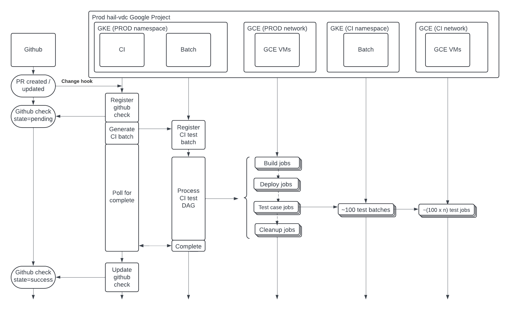
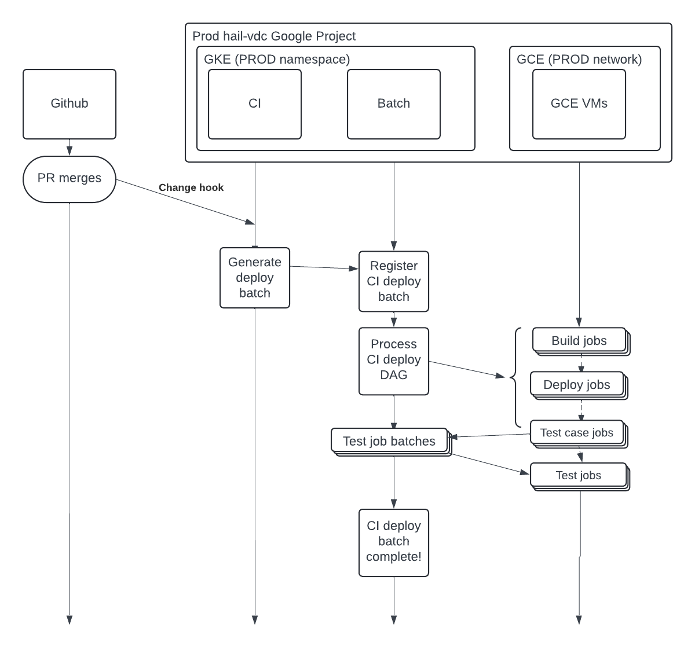

# The CI Service in Hail Batch

Hail Batch includes a CI service which has three jobs:

- Runs tests against pull requests
- Merges PRs to the `main` branch
- Deploys services to the live infrastructure

It does all of these things only if certain conditions are met.

## Deployment

The CI service itself is deployed as a Kubernetes service in the Hail Batch cluster. See 
[architecture diagram](../Hail Batch Architectural Diagram.png).

As part of its configuration, CI must be configured with an access token allowing it to operate on 
behalf of a github account called hail-ci-robot.

To make CI work it needs to receive update triggers from the github repository. These are
configured within the github repository itself.

## Running tests against pull requests

The CI service is constantly monitoring for new PRs in the `hail` repository. 

When a new PR is opened, or an existing PR changes, hooks are triggered which alert the CI service. 
The CI service will then:

- Check for validity
  - The author must be a known developer (or else a commit SHA can be individually approved via the CI service UI)
  - The PR must be against the `main` branch
- Run tests
  - The CI service will run tests against the PR
  - The CI service will report the results of the tests back to GitHub

### Running Tests

The process of running tests goes like:

- CI will generate a new batch and submit it against the production Hail Batch service using its own service credentials
- The batch contains jobs which will:
  - Clone the appropriate branch and build a new set of docker images for the updated services.
  - Deploy the batch suite of k8s services into one of many CI-owned namespaces in the Hail Batch cluster
    - These namespaces are called 
  - Run a series of tests against the services
  - Each test:
    - Submits a specially crafted batch to the newly deployed batch namespace
    - Checks that the results of running the batch are what we would expect
- The CI service polls the batch which it submits for overall success or failure.
- Once the batch has either succeeded or failed, CI uses that result to report status back to GitHub

Examples of CI test runs can be seen by searching through the production batch log, as long as you have developer
permissions. For example: `/batches?q=user+%3D+ci%0D%0Atest+%3D+1`

#### CI Testing Timeline

The image below shows the CI testing timeline:

## Merging PRs to the `main` branch

When a PR's status changes, it will trigger a hook which alerts the CI service. The CI service will 
determine whether the PR is ready to be merged. If it is, the CI service will merge the pull request.

Readiness is determined by github status checks. The following conditions must be met:

- The PR must be against the `main` branch
- The PR must have passed all tests (and there must be none outstanding)
- The PR must have sufficient approvals

## Deploying services to the live infrastructure

When a PR is merged into the `main` branch, the CI service will:

- Check for validity
  - The author must be a known developer
  - The PR must be against the `main` branch
- Create a new batch job to:
  - Build various components and service images
  - Deploy to a test namespace
  - Run tests against the services
  - Deploy to the `default` (ie prod) namespace
  - A handful of final actions
    - eg rolling out artifact registry cleanup policies, amongst many other things

Note: It's not actually quite as waterfall-y as this. In fact the jobs are all running in a hail
batch, and each service being deploy has its own path through the DAG. So it's quite possible that the services are 
test/deploy-ing in parallel, and that the deploy for one service might happen before the test for another has even begun.

This should all be fine, because it was previously tested as part of the PR approval process.

Examples of CI deploy runs can be seen by searching through the production batch log, as long as you have developer
permissions. For example: `/batches?q=user+%3D+ci%0D%0Adeploy+%3D+1`

#### CI Deploy Timeline

The image below shows the CI deployment timeline:

## Issues

### Hanging PR state

It is possible for a CI instance to fail when trying to update PR status. In that case,
the PRs would be hanging in a "pending" state. 

This can be fixed by pushing a new commit to the branch.

## References

- Diagrams source: [Link](https://lucid.app/lucidchart/e4fbcce3-5d73-4fa8-a729-eb2a4488d464/edit?viewport_loc=-97%2C228%2C2061%2C1115%2C12R1RM5CUFfr&invitationId=inv_148dfe48-17b2-49c8-bce7-fb06fc92bf48)  
