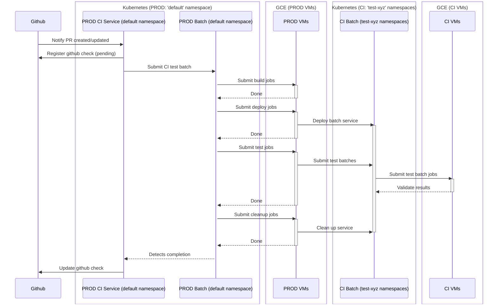
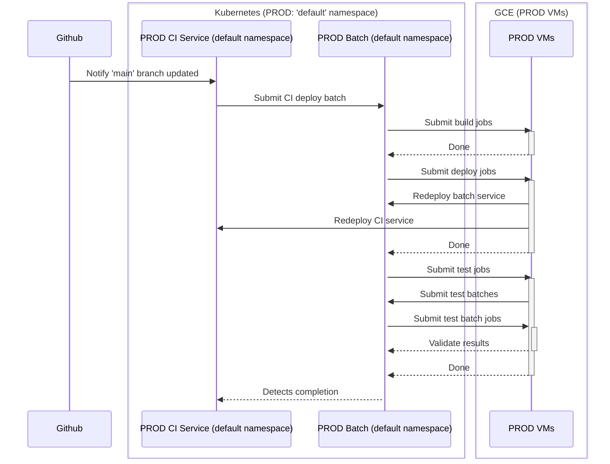

# The CI Service in Hail Batch

Hail Batch includes a CI service which has three jobs:

- Runs tests against pull requests
- Merges PRs to the `main` branch
- Deploys services to the live infrastructure

## Structure and Operation

The CI service itself is deployed as a Kubernetes service in the Hail Batch cluster. See 
[architecture diagram](../Hail%20Batch%20Architectural%20Diagram.png).

As part of its configuration, CI must be configured with an access token allowing it to operate on 
behalf of a github account called hail-ci-robot.

### CI Update Loop

The core CI update loop operates over a set of "watched branches" which each track three types of state flag which can 
be marked as dirty:
- The state of github ("`github_changed`")
- The state of the deployed system ("`batch_changed`")
- The state of the watched branch itself (for example - its current commit) ("`state_changed`")

In hail-is, there is exactly one watched branch, which is `hail-is/hail:main`.

At a configurable frequency, the CI service will mark every flag for each of its watched branches as dirty, which
will trigger a re-evaluation of the system state.

In hail-is, this polling happens every 5 minutes.

### Github Configuration

To make CI more responsive it can be configured to receive webhook event triggers from the github repository. 

These are configured manually within the github repository itself and not managed by terraform or deploy scripts.

- For hail-is, the webhook target is: `ci.hail.is/github_callback`
- For hail-is, webhook callbacks are configured to happen on changes to the following:
  - Pull request reviews
  - Pull requests
  - Pushes

Depending on the type of webhook received, and the branch which it is targeting, the CI service will
potentially dirty one of its watched branches' state flags, meaning that CI will prioritize re-evaluating
the state of the branch in question.

## Running tests against pull requests

When a PR which targets a watched branch is created, updated or closed, the github_changed flag will be marked as dirty. 

During its update loop, CI will potentially decide to run tests against all PRs targetting a watched branch:

- Authorization
  - If the author is in the [`ci/ci/constants`](../../../ci/ci/constants.py) list of known developers, it can be tested.
  - If the github SHA for the commit has been registered, it can be tested.
  - Otherwise, it will be ignored.
- Check for validity
  - The PR must be against a watched branch, or else it wouldn't be considered.
  - If the current commit has already had tests run against it, no further action is taken
  - If the PR is marked with the "do_not_test" label, no further action is taken
- Run tests
  - The CI service will run tests against the PR (see below) 
  - Report results back to Github using the Checks interface

### Running Tests

The process of running tests goes like:

- CI will create a pending Check against the PR in question
- CI will generate a new batch and submit it against the production Hail Batch service using its own service credentials
  - Tasks in the batch are defined in `build.yaml` in the top repo directory. CI generates jobs in the batch from the steps defined in there.
- The batch contains jobs which will:
  - Clone the appropriate branch
  - Squash and rebase against `main`
  - Build a new set of docker images for the updated services.
  - Deploy the batch suite of k8s services into one of many CI-owned namespaces in the Hail Batch cluster
    - These namespaces are named like `"pr-<PR_NUMBER>-<CI-NAMESPACE>-<RANDOM>"`
    - Where `CI-NAMESPACE` is the namespace where CI is running (usually `default`). 
  - Run a series of tests against the services
  - Each test:
    - Submits a specially crafted batch to the newly deployed batch namespace
    - Checks that the results of running the batch are what we would expect
- The CI service polls the batch which it submits for overall success or failure.
- Once the batch has either succeeded or failed, CI uses that result to report status back to GitHub

Examples of CI test runs can be seen by searching through the production batch log, as long as you are a member
of the `ci` billing project. For example: `/batches?q=user+%3D+ci%0D%0Atest+%3D+1`.

#### CI Testing Timeline

The image below shows the CI testing timeline:

## Merging PRs to the `main` branch

When a PR state changes, it will cause the `github_changed` flag to become dirty. 

During its update loop, the CI service will determine whether any PRs targeting its watched branches are elibible to
be merged.

Readiness is determined by github status checks. The following conditions must be met:

- The PR must be against the `main` branch
- The PR must have passed all tests in GCP
- The PR must be approved

The control flow from final approval to CI merging a PRs looks like:

- The PR's state will change in github (either a check changes to SUCCESS, or a review is approved)
- The github webhook callback will cause the `github_changed` flag will be marked as dirty for the `WatchedBranch`
- The `WatchedBranch`'s `_update` method in [`github.py`](../../../ci/ci/github.py) scans all PRs against the branch. For each PR:
  - If the status checks have changed, record that in the relevant PR object (linked from the WatchedBranch).
  - If review statuses have changed, record that in the relevant PR object (linked from the WatchedBranch).
  - In either case, mark the `state_changed` flag as dirty for the `WatchedBranch`
- The `WatchedBranch`'s `_update` method in [`github.py`](../../../ci/ci/github.py) determines that the `WatchedBranch`'s `state_changed` flag is dirty
- The `WatchedBranch`'s `tryToMerge()` method is called. It iterates over a list of PRs to:
  - Check whether they are mergeable (ie all tests have passed, and all reviews are approved)
  - If so: call `merge()`

## Deploying services to the live infrastructure

When a PR is merged into the `main` branch, a webhook will trigger. The CI service will set its `github_changed` flag.

During its update loop, the CI service will determine that the SHA of the `WatchedBranch` has changed and trigger
a deployment.

- Check for validity
  - The PR must be against the `main` branch
- Create a new batch job to:
  - Build various components and service images
  - Deploy to a test namespace
  - Run tests against the services
  - Deploy to the `default` (ie prod) namespace
  - A handful of final actions
    - eg rolling out artifact registry cleanup policies, amongst many other things

Note: It's not actually quite as waterfall-y as this. In fact the jobs are all running in a hail
batch, and each package being built and service being deployed has its own path through the DAG. So it's quite possible
that the services are test/deploy-ing in parallel, and that the deploy for one service might happen before the test for
another has even begun.

This should all be fine, because it was previously tested as part of the PR approval process.

Examples of CI deploy runs can be seen by searching through the production batch log, as long as you have developer
permissions. For example: `/batches?q=user+%3D+ci%0D%0Adeploy+%3D+1`

#### CI Deploy Timeline

The image below shows the CI deployment timeline:

## Issues

### Hanging PR state

It is sometimes possible for a PR status to be stuck in pending even though the test batch has completed
This can be fixed by pushing a new commit to the branch, but it's strange that regular polling does not catch
these instances.
 
## Open Questions

1. Sometimes in logs we see logs like `"update github br-hail-ci-test-ci-test-<RANDOM>-main"` for various random branch names. 
What does this mean?
