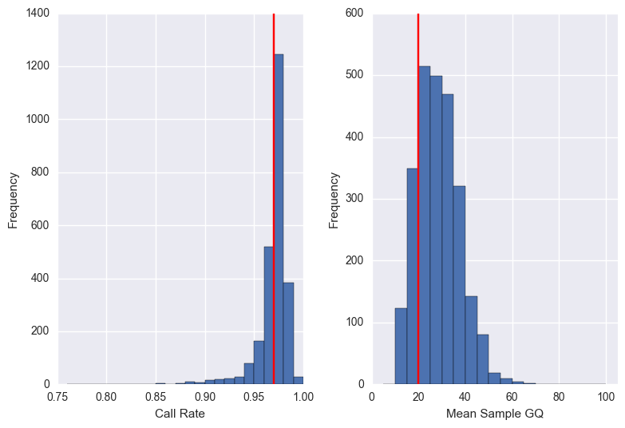
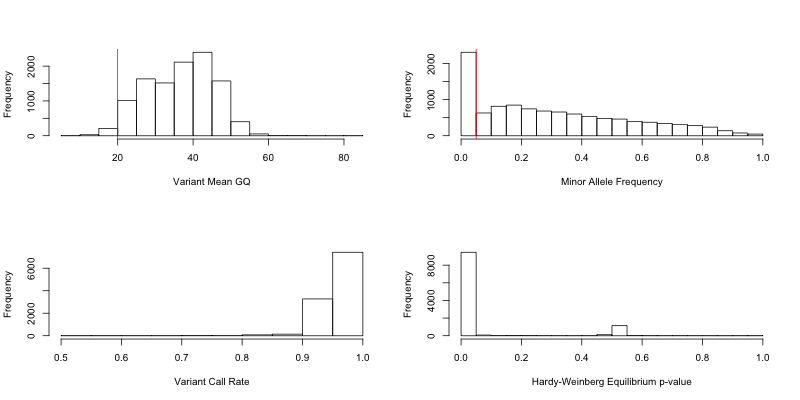
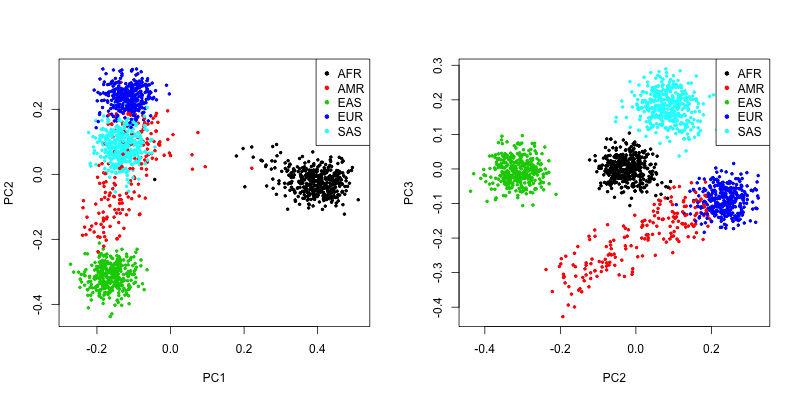
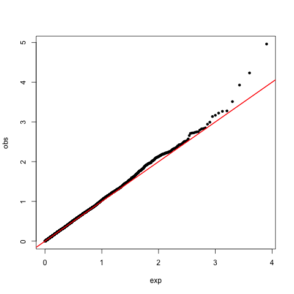
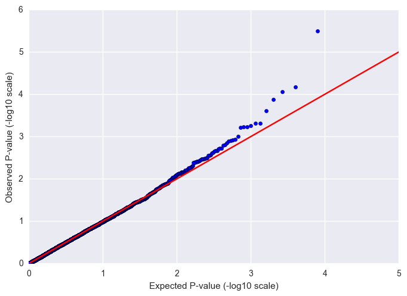
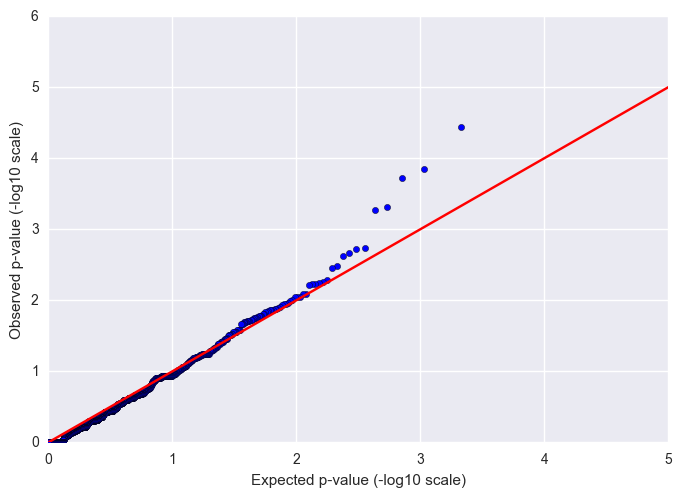

# Tutorial

In this tutorial, we will analyze data from the final phase of the [1000 Genomes Project](http://www.internationalgenome.org/about), as described in [A global reference for human genetic variation (Nature 2015)](http://www.nature.com/nature/journal/v526/n7571/full/nature15393.html). We have downsampled the dataset to approximately 10,000 variants consisting of both rare and common variants. We obtained sample information (population, super-population, sex) from the [1000 Genomes website](http://ftp.1000genomes.ebi.ac.uk/vol1/ftp/technical/working/20130606_sample_info/20130606_sample_info.xlsx).

If you haven't already installed Hail, go to [Getting Started](hail/getting_started.html) for instructions.

## Download tutorial data files

Download the zip file *Hail_Tutorial_Data-v1.tgz* using [`wget`](https://www.google.com/search?q=install+wget) or [`curl`](https://www.google.com/search?q=install+curl):
 
```
wget https://storage.googleapis.com/hail-tutorial/Hail_Tutorial_Data-v1.tgz
```

Unzip the file:

```
tar -xvzf Hail_Tutorial_Data-v1.tgz --strip 1
```
      
The contents are as follows:
  
  - 1000 Genomes Compressed VCF (downsampled to 10K variants) -- *1000Genomes.ALL.coreExome10K-v1.vcf.bgz*
  - Sample Annotations -- *1000Genomes.ALL.coreExome10K-v1.sample_annotations*
  - LD-pruned SNP List -- *purcell5k.interval_list*

## Start an IPython interactive shell

Start an IPython shell by running the command `ipython` from the directory containing the tutorial files. You should see a window similar to the one shown below. Otherwise, Anaconda is not installed properly.

```text
hail@tutorial-vm:~$ ipython
Python 2.7.12 |Anaconda 4.2.0 (64-bit)| (default, Jul  2 2016, 17:42:40)
Type "copyright", "credits" or "license" for more information.

IPython 5.1.0 -- An enhanced Interactive Python.
?         -> Introduction and overview of IPython's features.
%quickref -> Quick reference.
help      -> Python's own help system.
object?   -> Details about 'object', use 'object??' for extra details.

In [1]:
```

In this window, enter two commands:

    >>> from hail import *
    >>> hc = HailContext()

If there is no error, you're ready to start using Hail! Otherwise, make sure that the `export` variables are correctly set and appropriate versions of all dependencies are installed. If this step triggers a `Exception in thread "main" java.net.BindException`, see [here](https://hail.is/faq.html#how-do-i-fix-exception-in-thread-main-java.net.bindexception-cant-assign-requested-address-...) for a fix.

Before we start using Hail, please import the following python libraries for use throughout the tutorial:

    >>> import pandas as pd
    >>> import matplotlib.pyplot as plt
    >>> import matplotlib.patches as mpatches
    >>> import numpy as np
    >>> import seaborn
    >>> from math import log, isnan

## Import data

For cleanliness, let's first assign the names of data files to Python variables:

    >>> vcf = '1000Genomes.ALL.coreExome10K-v1.vcf.bgz'
    >>> sample_annotations = '1000Genomes.ALL.coreExome10K-v1.sample_annotations'
    >>> pruned_variants = 'purcell5k.interval_list'


We must first import variant data into Hail's internal format of Variant Dataset (VDS). We use the `import_vcf` method on `HailContext` to load the downsampled 1000 Genomes VCF into Hail. The VCF file is block-compressed (`.vcf.bgz`) which enables Hail to read the file in parallel. Reading files that has not been block-compressed (`.vcf`, `.vcf.gz`) is _significantly_ slower and should be avoided (though often `.vcf.gz` files are in fact block-compressed, so that renaming to `.vcf.bgz` solves the problem). 

    >>> vds = hc.import_vcf(vcf)

We next use the `split_multi` method on `dataset` to split multi-allelic variants into biallelic variants. For example, the variant `1:1000:A:T,C` would become two variants: `1:1000:A:T` and `1:1000:A:C`.

    >>> vds = vds.split_multi()

We next use the `annotate_samples_table` method to load phenotypic information on each sample from the sample annotations file.

    >>> vds = vds.annotate_samples_table(sample_annotations, 
    >>>                                  root='sa.pheno', 
    >>>                                  sample_expr='Sample', 
    >>>                                  config=TextTableConfig(impute=True))

Let's dig into command. `sample_annotations` refers to the sample annotation data file, whose first few lines are:

```
Sample  Population      SuperPopulation isFemale        PurpleHair      CaffeineConsumption
HG00096 GBR     EUR     False   False   77.0
HG00097 GBR     EUR     True    True    67.0
HG00098 GBR     EUR     False   False   83.0
HG00099 GBR     EUR     True    False   64.0
HG00100 GBR     EUR     True    False   59.0
HG00101 GBR     EUR     False   True    77.0
HG00102 GBR     EUR     True    True    67.0
```

The `root` argument says where to put this data. For sample annotations, the root must start with `sa` followed by a `.` and the rest is up to you, so let's use `sa.pheno`.

The `sample_expr` argument defines how to select the sample ID. In this case, the column name containing the sample ID is `Sample`.

The object `TextTableConfig` allows users to provide information about column data types, header existence, comment characters, and field delimiters. Here we'd like to store columns 'isFemale' and 'PurpleHair' as Booleans and the 'CaffeineConsumption' column as Doubles (floating-point). We could do so by passing an explicit type string to `TextTableConfig` of the form 'isFemale: Boolean, PurpleHair: Boolean, CaffeineConsumption: Boolean'.  Instead, we pass `impute=True` to infer column types automatically.

Lastly, we'll write the dataset to disk so that all future computations begin by reading in the fast VDS rather than the slow VCF.

    >>> out_path = '1kg.vds'
    >>> vds.write(out_path)

## Start exploring

Now we're ready to start exploring! Let's practice reading the vds back in:

    >>> vds = hc.read(out_path)

First, we'll print some statistics about the size of the dataset using `count`:

    >>> vds.count()

If the Boolean parameter `genotypes` is set to `True`, the overall call rate across all genotypes is computed as well:

    >>> vds.count(genotypes=True)
    
<pre class="tutorial output" style="color: red">
Out[8]: {u'nGenotypes': 27786135L, u'nVariants': 10961L, u'nSamples': 2535, u'nCalled': 27417806L, u'callRate': 98.6744144156789}
</pre>

So the call rate before any QC filtering is about 98.7%.

Let's print the types of all annotations.

    >>> vds.print_schema()

Note the annotations imported from the original VCF, as well as the sample annotations added above. Notice how those six sample annotations loaded above are nested inside `sa.pheno` as defined by the `root` option in `annotate_samples table`.

Next, we'll add some global annotations including the list the populations that are present in our dataset and counts of the number of samples in each population, using the Hail expression language and the `annotate_global_expr_by_sample` method. The 1000 Genomes Super-Population codings are:

  - SAS = South Asian
  - AMR = Americas
  - EUR = European
  - AFR = African
  - EAS = East Asian

We'll first build up a list of annotation expressions, evaluate them on the dataset, and print the resulting global annotations.

    >>> expressions = [ 
    >>>   'global.populations = samples.map(s => sa.pheno.Population).collect().toSet',
    >>>   'global.superPopulations = samples.map(s => sa.pheno.SuperPopulation).collect().toSet',
    >>>   'global.nCases = samples.filter(s => sa.pheno.PurpleHair).count()',
    >>>   'global.nControls = samples.filter(s => !sa.pheno.PurpleHair).count()',
    >>>   'global.nSamples = samples.count()' ]
    >>> vds.annotate_global_expr_by_sample(expressions).show_globals()
    
<pre class="tutorial output" style="color: red">
Global annotations: `global' = {
  "populations" : [ "MSL", "GIH", "ASW", "JPT", "KHV", "CEU", "STU", "CDX", "BEB", "PUR", "ITU", "CLM", "GWD", "TSI", "ESN", "IBS", "PEL", "ACB", "YRI", "PJL", "CHS", "MXL", "CHB", "LWK", "FIN", "GBR" ],
  "superPopulations" : [ "SAS", "AMR", "EUR", "AFR", "EAS" ],
  "nCases" : 1300,
  "nControls" : 1235,
  "nSamples" : 2535
}
</pre>

Now it's easy to count samples by population using the `counter()` aggregator:

    >>> vds.annotate_global_expr_by_sample('global.count_by_pop = samples.map(s => sa.pheno.SuperPopulation).counter()').show_globals()

## Quality control (QC)

Before testing whether there is a genetic association for a given trait, let's clean up the raw data by filtering out genotypes that don't have strong evidence supporting the genotype call, samples that are outliers on key summary statistics across the dataset, and variants with low mean genotype quality or out of [Hardy-Weinberg equilibrium](https://en.wikipedia.org/wiki/Hardy–Weinberg_principle).

The QC procedures below are a sampler covering various features of Hail, not an optimal pipeline for your research.

For filtering, we make extensive use of the [Hail expression language](reference.html#HailExpressionLanguage). Here `g` is genotype, `v` is variant, `s` is sample, and annotations are accessible via `va`, `sa`, and `global`. 

##### Filter genotypes

Let's filter genotypes based on allelic balance using the `filter_genotypes` method.

    >>> filter_condition = '''let ab = g.ad[1] / g.ad.sum in
    >>>                          ((g.isHomRef && ab <= 0.1) || 
    >>>                           (g.isHet && ab >= 0.25 && ab <= 0.75) || 
    >>>                           (g.isHomVar && ab >= 0.9))'''
    >>> vds_gAB = vds.filter_genotypes(filter_condition)

In this code, we first construct a expression `filter_condition` that evaluates to a Boolean using the . We use `let ... in` to define a temporary variable `ab` for the allelic balance which is calculated from the allelic depth `g.ad`, a zero-indexed array (so `g.ad[0]` and `g.ad[1]` are read counts for reference allele and alternate allele, respectively). We require for homozygous call that the allelic balance be within `.1` of the expected mode, and that for heterozygote calls (`g.isHet`) the allelic balance be between 0.25 and 0.75. Additional methods on genotype are documented [here](reference.html#genotype).

    >>> vds_gAB.count(genotypes=True)

Now the call rate is about 95%, so nearly 4% of genotypes failed the filter (filtering out a genotype is equivalent to setting the genotype call to missing).

<pre class="tutorial output" style="color: red">
  nGenotypes      27,786,135
  nSamples             2,535
  nVariants           10,961
  nCalled         26,404,807
  callRate           95.029%
</pre>

#### Filter samples

Having removed suspect genotypes, let's next remove variants with low call rate and then calculate summary statistics per sample with the `sample_qc` method.
 
    >>> vds_gAB_vCR = (vds_gAB
    >>>     .filter_variants_expr('gs.fraction(g => g.isCalled) > 0.95')
    >>>     .sample_qc())

The call rate for each variant is calculated using the `fraction` [aggregable](reference.html#aggregables) on the genotypes `gs`. `sampleqc` adds a number of statistics to sample annotations documented [here](commands.html#sampleqc). Let's print the new sample annotation schema schema:

    >>> vds_gAB_vCR.print_schema(sa=True)

Let's export these sample annotations to a text file:

    >>> vds_gAB_vCR.export_samples('sampleqc.txt', 'Sample = s.id, sa.qc.*')

`%%sh` is a handy IPython magic command that allows you to peek at this file without leaving the IPython interpreter.

    >>> %%sh
    >>> head sampleqc.txt | cut -f 1,2,3,4,5,6,7,8,9,10

<pre class="tutorial output" style="color: red"> 
Sample	callRate	nCalled	nNotCalled	nHomRef	nHet	nHomVar	nSNP	nInsertion	nDeletion
HG02970	9.69313e-01	5433	172	3919	822	692	2206	0	0
NA19089	9.78947e-01	5487	118	4072	729	686	2101	0	0
NA18861	9.73417e-01	5456	149	3925	855	676	2207	0	0
HG02122	9.75022e-01	5465	140	4026	730	709	2148	0	0
NA20759	9.71097e-01	5443	162	4068	748	627	2002	0	0
HG00139	9.85370e-01	5523	82	4080	833	610	2053	0	0
NA12878	9.67351e-01	5422	183	4081	694	647	1988	0	0
HG02635	9.82337e-01	5506	99	3927	927	652	2231	0	0
NA19660	9.45049e-01	5297	308	3910	685	702	2089	0	0
</pre>

We can further analyze these results locally using tools like Python or R. Below is an example plot of two variables (call rate and meanGQ).



Let's remove the samples that are outliers in the plots above (where cutoffs are given the red lines). We will remove these samples from `vds_gAB` (after filtering genotypes but before filtering variants) because it's possible that poor-quality samples decreased the call rate on variants we'd actually like to keep. Here are two of the many ways we could do this step: 

**Method 1:** Export a list of samples to keep from `vds_gAB_vCR`, and filter samples from `vds_gAB` based on this list.

    >>> (vds_gAB_vCR
    >>>     .filter_samples_expr('sa.qc.callRate >= 0.97 && sa.qc.gqMean >= 20')
    >>>     .export_samples('included_samples.txt', 's.id'))
    >>> vds_gAB_sCR_sGQ = vds_gAB.filter_samples_list('included_samples.txt')
    >>>
    >>> print('before filter: %d samples' % vds_gAB.num_samples())
    >>> print('after filter: %d samples' % vds_gAB_sCR_sGQ.num_samples())
    >>> method_1_kept_ids = vds_gAB_sCR_sGQ.sample_ids()
    
**Method 2:** Annotate and filter `vds_gAB` using the exported sample QC metrics:

    >>> vds_gAB_sCR_sGQ = (vds_gAB
    >>>     .annotate_samples_table('sampleqc.txt', sample_expr='Sample', 
    >>>                             root='sa.qc', config=TextTableConfig(impute=True))
    >>>     .filter_samples_expr('sa.qc.callRate >= 0.97 && sa.qc.gqMean >= 20'))
    >>>
    >>> print('before filter: %d samples' % vds_gAB.num_samples())
    >>> print('after filter: %d samples' % vds_gAB_sCR_sGQ.num_samples())
    >>> method_2_kept_ids = vds_gAB_sCR_sGQ.sample_ids()
    
Let's make sure these two methods give us the same samples:

    >>> method_1_kept_ids == method_2_kept_ids

As before, let's use the `annotate_global_expr_by_sample` method to count the number of samples by phenotype that remain in the dataset after filtering.

    >>> post_qc_exprs = [
    >>>     'global.postQC.nCases = samples.filter(s => sa.pheno.PurpleHair).count()',
    >>>     'global.postQC.nControls = samples.filter(s => !sa.pheno.PurpleHair).count()' ]
    >>> vds_gAB_sCR_sGQ.annotate_global_expr_by_sample(post_qc_exprs).show_globals()     

<pre class="tutorial output" style="color: red">
Global annotations: `global' = {
  "postQC" : {
    "nCases" : 840,
    "nControls" : 806,
  }
}
</pre>

#### Filter variants

We now have `vds_gAB_sCR_sGQ`, a VDS where both poor genotypes and samples have been removed.

Let's use the `variant_qc` method to start exploring variant metrics and `export_variants` to exports the resulting variant annotations as a text file:

    >>> vds_gAB_sCR_sGQ = vds_gAB_sCR_sGQ.variant_qc()
    >>> vds_gAB_sCR_sGQ.print_schema(va=True)
    >>> vds_gAB_sCR_sGQ.export_variants('variantqc.tsv',
    >>>                                'Chrom=v.contig, Pos=v.start, Ref=v.ref, Alt=v.alt, va.qc.*')

The string `va.qc.*` specifies that all annotations in the struct `va.qc` should be included as columns. We could also have written the export expression above as `Variant = v, va.qc.*` in which case the `Variant` column would have the format "Contig:Pos:Ref:Alt".

We've used R to make histograms of four summary statistics (call rate, allele frequency, mean GQ, and [Hardy Weinberg Equilibrium P-value](https://en.wikipedia.org/wiki/Hardy–Weinberg_principle)). Notice how the histogram for HWE does not look as one would expect (most variants should have a p-value close to 1). This is because there are 5 populations represented in this dataset and the p-value we calculated is based on all populations together.


Let's use the `annotate_variants_expr` method to programmatically compute Hardy Weinberg Equilibrium for each population. First, we construct `hwe-expressions`.

    >>> hwe_expressions = [
    >>>     'va.hweByPop.hweEUR = gs.filter(g => sa.pheno.SuperPopulation == "EUR").hardyWeinberg()',
    >>>     'va.hweByPop.hweSAS = gs.filter(g => sa.pheno.SuperPopulation == "SAS").hardyWeinberg()',
    >>>     'va.hweByPop.hweAMR = gs.filter(g => sa.pheno.SuperPopulation == "AMR").hardyWeinberg()',
    >>>     'va.hweByPop.hweAFR = gs.filter(g => sa.pheno.SuperPopulation == "AFR").hardyWeinberg()',
    >>>     'va.hweByPop.hweEAS = gs.filter(g => sa.pheno.SuperPopulation == "EAS").hardyWeinberg()' ]


Using Python's list comprehensions, we can do this a bit more tersely. A format like this will be prefered for the remainder of the tutorial. 

    >>> populations = ['EUR', 'SAS', 'AMR', 'AFR', 'EAS']
    >>> hwe_expressions = ['va.hweByPop.hwe' + pop + ' = gs.filter(g => sa.pheno.SuperPopulation == "' + pop + '").hardyWeinberg()' for pop in populations]

Then we go ahead and use `annotate_variants_expr`.

    >>> vds_gAB_sCR_sGQ = vds_gAB_sCR_sGQ.annotate_variants_expr(hwe_expressions)
    >>> vds_gAB_sCR_sGQ.persist()
    >>> vds_gAB_sCR_sGQ.print_schema(va=True)

Above, for each variant, we filter the genotypes to only those genotypes from the population of interest using a filter function on the [genotype aggregable](reference.html#aggregables) and then calculate the Hardy-Weinberg Equilibrium p-value using the [`hardyWeinberg`](reference.html#aggreg_hwe) function on the filtered genotype aggregable.

The `persist` method caches the dataset in its current state on memory/disk, so that downstream processing will be faster. 

`print_schema` reveals that we've added new fields to the variant annotations for HWE p-values for each population. We've got quite a few variant annotations now! Notice that the results of these annotation statements are structs containing two elements:

<pre class="tutorial output" style="color: red">
Variant annotation schema:
...
        hweEUR: Struct {
            rExpectedHetFrequency: Double,
            pHWE: Double
        },
        hweSAS: Struct {
            rExpectedHetFrequency: Double,
            pHWE: Double
        },
        hweAMR: Struct {
            rExpectedHetFrequency: Double,
            pHWE: Double
        },
        hweAFR: Struct {
            rExpectedHetFrequency: Double,
            pHWE: Double
        },
        hweEAS: Struct {
            rExpectedHetFrequency: Double,
            pHWE: Double
        }
    }
}
</pre>
 

We can now filter variants based on HWE p-values with respect to each population:

    >>> hwe_filter_expression = "&&\n".join(['va.hweByPop.hwe' + pop + '.pHWE > 1e-6 ' for pop in populations])
    >>> vds_gAD_sCR_sGQ_vHWE = vds_gAB_sCR_sGQ.filter_variants_expr(hwe_filter_expression)
    >>> vds_gAD_sCR_sGQ_vHWE.count()

We see from `count` that by calculating HWE p-values in each population separately, we only filter out 826 variants (before it would have been 7098 variants!).

<pre class="tutorial output" style="color: red">
Out[49]: {u'nSamples': 1646, u'nVariants': 10135L, u'nGenotypes': 16682210L}
</pre>


Lastly we use the `filter_variants expr`method to keep variants with a mean GQ greater than or equal to 20.

    >>> vds_gAD_sCR_sGQ_vHWE_vGQ = hwe_filtered_vds.filter_variants_expr('va.qc.gqMean >= 20')
    >>> vds_gAD_sCR_sGQ_vHWE_vGQ.count()


<pre class="tutorial output" style="color: red">
{u'nSamples': 1646, u'nVariants': 9949L, u'nGenotypes': 16376054L}
</pre>
  
We can see we have filtered out 1,012 total variants from the dataset.

#### Sex check

It's *always* a good idea to check that the reported sex of samples is consistent with sex chromosome ploidy estimated from the genetic data. A high sex-check failure rate suggests that sample swaps may have occurred.

There are 273 many X chromosome variants are in the original dataset:

    >>> vds.filter_variants_expr('v.contig == "X"').num_variants()
  
However, after variant QC, the number of X chromosome variants drops to 10, not enough for a sex check!

    >>> vds_gAD_sCR_sGQ_vHWE_vGQ.filter_variants_expr('v.contig == "X"').num_variants()

Oops! HWE statistics on the X chromosome should ignore male samples, since males have only two possible genotypes (HomRef or HomVar). We're going to have to go back to `vds_gAB_sCR_sGQ` and modify how we calculate HWE. We use a conditional expression so that variants on the X chromosome will only include female samples in the calculation. We can also use the same `hwe_filter_expression` from above.


    >>> sex_aware_hwe_exprs = [
    >>> '''va.hweByPop.hwe{pop} = 
    >>> if (v.isAutosomal)
    >>>  gs.filter(g => sa.pheno.SuperPopulation == "{pop}").hardyWeinberg()
    >>> else
    >>>   gs.filter(g => sa.pheno.SuperPopulation == "{pop}" && sa.pheno.isFemale).hardyWeinberg()'''.format(pop = p) for p in populations]
    >>> 
    >>> vds_filtered = (vds_gAB_sCR_sGQ
    >>>     .annotate_variants_expr(sex_aware_hwe_exprs)
    >>>     .filter_variants_expr(hwe_filter_expression)
    >>>     .filter_variants_expr('va.qc.gqMean >= 20')
    >>>     .persist())
    >>>
    >>> print('total variants = %s' % vds_filtered.num_variants())
    >>> print('X chromosome variants = %s' % vds_filtered.filter_variants_expr('v.contig == "X"').num_variants())
  
For sex check, we first use the `impute_sex` method with a minimum minor allele frequency threshold `maf_threshold` argument of 0.05 to determine the genetic sex of a sample based on the inbreeding coefficient. `impute_sex` adds the Boolean sample annotation `sa.imputesex.isFemale` and we then create a new Boolean sample annotation `sa.sexcheck` which indicates whether the imputed sex `sa.imputesex.isFemale` is the same as the reported sex `sa.pheno.isFemale`.


    >>> vds_sex_check = (vds_filtered
    >>>     .impute_sex(maf_threshold=0.05)
    >>>     .annotate_samples_expr('sa.sexcheck = sa.pheno.isFemale == sa.imputesex.isFemale'))
    >>> total_samples = vds_sex_check.num_samples()
    >>> sex_check_passes = vds_sex_check.filter_samples_expr('sa.sexcheck').num_samples()
    >>>
    >>> print('total samples: %s' % total_samples)
    >>> print('sex_check_passes: %s' % sex_check_passes)
    
We see that the genetic sex does not match the reported sex for 567 samples, an extremely high sex check failure rate! To figure out why this happened, we can use a Hail expression to look at the values that `sa.sexcheck` takes.

    >>> (vds_sex_check.annotate_global_expr_by_sample(
    >>>     'global.sexcheckCounter = samples.map(s => sa.sexcheck).counter()')
    >>>     .show_globals())

Aha! While we only have 3 'false' sex-check values, we have 564 missing sex-check values. Since `pheno.isFemale` is never missing (see the sample annotations file), this means that there were 564 samples that could not be imputed as male or female. This is because in our small dataset the number of variants on the X chromosome (about 200) is not sufficient to impute sex reliably. Let's instead keep those samples with missing sex-check using:
 
    >>> vds_QCed = vds_sex_check.filter_samples_expr('sa.sexcheck || isMissing(sa.sexcheck)').persist()
    >>> print('samples after filter: %s' % vds_QCed.num_samples())

## PCA

To account for population stratification in association testing, we use principal component analysis to compute features that are proxies for genetic similarity. PCA is typically performed on variants in linkage equilibrium. The text file *purcell5k.interval_list* contains a list of such independent common variants.

To calculate principal components, we first use the `filter_variants_intervals` method to only keep SNPs from this list. Next, we use the `pca` method to calculate the first 10 principal components (10 is the default number). The results are stored as sample annotations with root given by the `scores` parameter. 

    >>> vds_pca = (vds_QCed.filter_variants_intervals('purcell5k.interval_list')
    >>>     .pca(scores='sa.pca'))
    
We can then make a python plot of the samples in PC space colored by population group:

    >>> pca_table = vds_pca.samples_keytable().to_pandas()
    >>> colors = {'AFR': 'black', 'AMR': 'red', 'EAS': 'green', 'EUR': 'blue', 'SAS': 'cyan'}
    >>> plt.scatter(pca_table["sa.pca.PC1"], pca_table["sa.pca.PC2"], c = pca_table["sa.pheno.SuperPopulation"].map(colors), alpha = .5)
    >>> plt.xlabel("PC1")
    >>> plt.ylabel("PC2")
    >>> legend_entries = [mpatches.Patch(color= c, label=pheno) for pheno, c in colors.items()]
    >>> plt.legend(handles=legend_entries)
    >>> plt.show()



## Association testing

Now that we have a clean dataset with principal components, let's test for association between genetic variation and the phenotypes PurpleHair (dichotomous) and CaffeineConsumption (continuous).

#### Linear regression with covariates

Let's run linear regression on `vds_QCed`. First, we will filter out variants with a allele frequency less than 5% or greater than 95%. Next, we use the `linreg` method, specifying the response variable `y` to be the sample annotation for CaffeineConsumption `sa.pheno.CaffeineConsumption`. We also use 4 sample covariates `sa.pca.PC1`, `sa.pca.PC2`, `sa.pca.PC3`, `sa.pheno.isFemale` in addition to the intercept. The results of linear regression are stored as variant annotations and can be accessed with the root name `va.linreg`. 

    >>> vds_gwas = (vds_QCed
    >>>     .filter_variants_expr('va.qc.AF > 0.05 && va.qc.AF < 0.95')
    >>>     .annotate_samples_vds(vds_pca, code='sa.pca = vds.pca')
    >>>     .linreg('sa.pheno.CaffeineConsumption', 
    >>>             covariates='sa.pca.PC1, sa.pca.PC2, sa.pca.PC3, sa.pheno.isFemale'))

To examine this, we can create a Q-Q plot. We are going to be doing this a couple of times, so let's first define a function for this purpose.
    
    >>> def qqplot(pvals, xMax, yMax):
    >>>     spvals = sorted(filter(lambda x: not(isnan(x)), pvals))
    >>>     exp = [-1 * log(i / len(spvals), 10) for i in np.arange(1, len(spvals) + 1, 1)]
    >>>     obs = [-1 * log(p, 10) for p in spvals]
    >>>     plt.scatter(exp, obs)
    >>>     plt.plot(np.arange(0, max(xMax, yMax)), c="red")
    >>>     plt.xlabel("exp")
    >>>     plt.ylabel("obs")
    >>>     plt.xlim(0, xMax)
    >>>     plt.ylim(0, yMax)
    >>>     plt.show() 
    
With this new function, we can make a Q-Q plot for our linear regression by simply doing:


    >>> linreg_pvals = sorted(vds_gwas.variants_keytable().to_pandas()["va.linreg.pval"])
    >>> qqplot(linreg_pvals, 5, 6)
    


#### Logistic regression with covariates

We start from our `vds_gwas`. The logistic regression method also takes a test type argument. We will use the Wald test.

    >>> vds_gwas = (vds_gwas
    >>>     .logreg(test='wald', y='sa.pheno.PurpleHair',
    >>>             covariates='sa.pca.PC1, sa.pca.PC2, sa.pca.PC3, sa.pheno.isFemale'))
    
Once again, we can use our Q-Q plot function:

    >>> logreg_pvals = vds_gwas.variants_keytable().to_pandas()["va.logreg.wald.pval"]
    >>> qqplot(logreg_pvals, 5, 6)



#### Fisher's Exact Test for Rare Variants

We'll start with `vds_QCed` here (our `vds_gwas` isn't appropriate for rare variant tests because we filtered them all out!). This time we filter to rare variants (allele frequency less than 5% or greater than 95%). Next we annotate variants with 4 metrics about the aggregate statistics of the samples at each position. These new variant annotations can be used as inputs to the `fet` (Fisher Exact Test) function which takes 4 integers representing a 2x2 contingency table. We define the variant annotation `va.fet` to be the output of the [`fet`](reference.html#fet) function. All of this is saved to vds_fet, from which we use a variants keytable to extract p-values. 

    >>> rare_variant_annotations = [
    >>>     '''va.minorCase = 
    >>>         gs.filter(g => sa.pheno.PurpleHair && g.isHet).count() +
    >>>         2 * gs.filter(g => sa.pheno.PurpleHair && g.isHomVar).count()''',
    >>>     '''va.minorControl = 
    >>>         gs.filter(g => !sa.pheno.PurpleHair && g.isHet).count() + 
    >>>         2 * gs.filter(g => !sa.pheno.PurpleHair && g.isHomVar).count()''',
    >>>     '''va.majorCase = 
    >>>         gs.filter(g => sa.pheno.PurpleHair && g.isHet).count() +
    >>>         2 * gs.filter(g => sa.pheno.PurpleHair && g.isHomRef).count()''',
    >>>     '''va.majorControl = 
    >>>         gs.filter(g => !sa.pheno.PurpleHair && g.isHet).count() +
    >>>         2 * gs.filter(g => !sa.pheno.PurpleHair && g.isHomRef).count()''' ]
    >>>
    >>> vds_fet = (vds_QCed
    >>>     .filter_variants_expr('va.qc.AF <= 0.05 || va.qc.AF >= 0.95')
    >>>     .annotate_variants_expr(rare_variant_annotations)
    >>>     .annotate_variants_expr('''va.fet = 
    >>>                                 fet(va.minorCase.toInt, va.minorControl.toInt,
    >>>                                     va.majorCase.toInt, va.majorControl.toInt)'''))
    >>>
    >>> fet_pvals = vds_fet.variants_keytable().to_pandas()["va.fet.pValue"]
    >>> qqplot(fet_pvals, 5, 6)



## Eplilogue

Congrats! If you've made it this far, you're perfectly primed to read the [Overview](hail/overview.html), look through the [Hail objects](hail/hail_objects.html) representing many core concepts in genetics, and check out the many Hail functions defined in the [Python API](https://hail.is/hail/api.html). As you use Hail for your own science, we'd love to hear from you on [Gitter Chat](https://gitter.im/hail-is/hail) or the [Discussion Forum](http://discuss.hail.is).