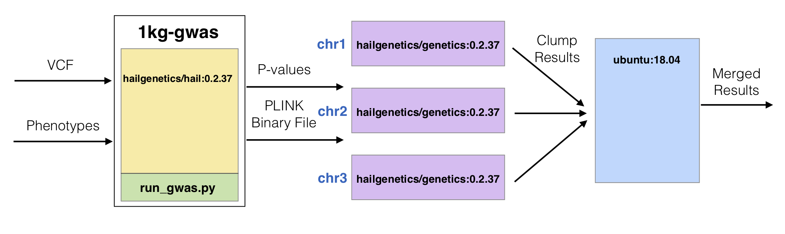

.. _sec-cookbook-clumping:

=====================
Clumping GWAS Results
=====================

Introduction
------------

After performing a genome-wide association study (GWAS) for a given phenotype,
one thing an analyst might want to do is clump the results based on the correlation
between variants and p-values. The goal is to get a list of independent
associated loci accounting for linkage disequilibrium between SNPs.

For example, given a locus with three variants: SNP1, SNP2, and SNP3.
SNP1 has a p-value of 1e-8, SNP2 has a p-value of 1e-7, and SNP3 has a
p-value of 1e-6. The correlation between SNP1 and SNP2 is 0.95, SNP1 and
SNP3 is 0.8, and SNP2 and SNP3 is 0.7. We would want to report SNP1 has the
most associated variant with the phenotype and "clump" SNP2 and SNP3 with the
association highlighted by SNP1.

To demonstrate how to perform LD-based clumping with Batch, we'll use the
1000 Genomes dataset from the `Hail GWAS tutorial <https://hail.is/docs/0.2/tutorials/01-genome-wide-association-study.html>`__.
First, we'll download the 1000 Genomes tutorial data locally. First,
we'll write a Python Hail script that performs a GWAS for caffeine
consumption and exports the results as a binary PLINK file and a TSV
with the association results. Second, we'll build a docker image containing
the custom GWAS script and Hail pre-installed and then push that image
to the Google Container Repository. Lastly, we'll write a Python script
that creates a Batch workflow for LD-based clumping using the Docker image
from step 2, a second publicly-available Docker image containing common
bioinformatics tools such as PLINK, and the Ubuntu 18.04 Docker image to
merge results computed per chromosome into a single output file. Ultimately,
we'll build a job computation graph with input and output files that looks
like the one depicted in the image below and execute it with the Batch Service.

Create Hail GWAS Script
-----------------------

We wrote a stand-alone Python script `run_gwas.py` that takes a VCF file, a phenotypes file,
the output destination file root, and the number of cores to use as input arguments.
The Hail code for performing the GWAS is described
`here <https://hail.is/docs/0.2/tutorials/01-genome-wide-association-study.html>`__.
We export two sets of files to the file root defined by `--output-file`. The first is
a `binary PLINK file <http://zzz.bwh.harvard.edu/plink/binary.shtml>`__ set with three files
ending in `.bed`, `.bim`, and `.fam`. We also export a file with two columns SNP and P which
contain the GWAS p-values per variant.

Notice the lines highlighted below. Hail will attempt to use all cores on the computer if no
defaults are given. However, with Batch, we only get a subset of the computer, so we must
explicitly specify how much resources Hail can use based on the input argument `--cores`.

.. literalinclude:: files/run_gwas.py
    :language: text
    :emphasize-lines: 47-48
    :caption: run_gwas.py
    :name: run_gwas

Create Docker Image
-------------------

We have the Hail Python script from above. However, we need some way to package up this script
inside a Docker image that has Hail in it in order to use Batch. Luckily, the Hail team has
created a Docker image that's publicly available that has Hail v.0.2.37 already installed.
We create a Dockerfile that lists we're building from `hailgenetics/hail:0.2.37` and then
copy the `run_gwas.py` script from above into the image.

.. literalinclude:: files/Dockerfile
    :language: docker
    :caption: Dockerfile
    :name: Dockerfile

To build this new Docker image, we run the following Docker command:

.. code-block:: sh

    docker pull hailgenetics/hail:0.2.37
    docker build -t 1kg-gwas -f Dockerfile .

However, Batch cannot use this image without it being pushed to a Docker image repository
on the cloud. There exist two options of where to push images to: Dockerhub which should be
used for images you want to make public for others and the Google Container Repository (GCR)
which is good for private images. It is **not** advisable to put any type of credentials inside
a Docker image!

To push the Docker image to GCR, we run the following Docker command:

.. code-block:: sh

    docker tag 1kg-gwas gcr.io/<MY_PROJECT>/1kg-gwas
    docker push gcr.io/<MY_PROJECT>/1kg-gwas

Replace `<MY_PROJECT` with the name of your Google project. Make sure your Batch service account
can access images in GCR by following the directions :ref:`here <service-accounts>`.

Execute Batch
-------------

The next thing we want to do is write a Hail Batch script to execute LD-based clumping of
association results for the 1000 genomes dataset.

~~~~~~~~~
Functions
~~~~~~~~~

GWAS
~~~~

To start, we will write a function that creates a new :class:`.Job` on an existing :class:`.Batch` that
takes as arguments the VCF file and the phenotypes file. The return value of this
function is the :class:`.Job` that is created in the function, which can be used later to
access the binary PLINK file output and association results in downstream jobs.

.. code-block:: python

    def run_gwas(batch, vcf, phenotypes):
        """
        QC data and get association test statistics
        """
        cores = 2
        gwas = batch.new_job(name='run-gwas')
        gwas.image('gcr.io/<MY_PROJECT>/1kg-gwas:latest')
        gwas.cpu(cores)
        gwas.declare_resource_group(ofile={
            'bed': '{root}.bed',
            'bim': '{root}.bim',
            'fam': '{root}.fam',
            'assoc': '{root}.assoc'
        })
        gwas.command(f'''
    python3 /run_gwas.py \
        --vcf {vcf} \
        --phenotypes {phenotypes} \
        --output-file {gwas.ofile} \
        --cores {cores}
    ''')
        return gwas

A couple of things to note about this function:

 - We specify the image to use is the image we created above. We copied the `run_gwas.py`
   script into the root directory `/`. Therefore, to execute the `run_gwas.py` script, we
   call `/run_gwas.py`.

 - The `run_gwas.py` script takes an output-file parameter and then creates files ending with
   the extensions `.bed`, `.bim`, `.fam`, and `.assoc`. In order for Batch to know the script is
   creating files as a group with a common file root, we need to use the :meth:`.Job.declare_resource_group`
   method. We then pass `gwas.ofile` as the output file root to `run_gwas.py` as that represents the temporary file
   root given to all files in the resource group (`{root}`) when declaring the resource group).

Clumping By Chromosome
~~~~~~~~~~~~~~~~~~~~~~

The second function performs clumping for a given chromosome. The input arguments are the :class:`.Batch`
for which to create a new :class:`.Job`, the PLINK binary file **root**, the association results
with at least two columns (SNP and P), and the chromosome for which to do the clumping for.
The return value is the new :class:`.Job` created.

.. code-block:: python

    def clump(batch, bfile, assoc, chr):
        """
        Clump association results with PLINK
        """
        c = batch.new_job(name=f'clump-{chr}')
        c.image('hailgenetics/genetics:0.2.37')
        c.memory('1Gi')
        c.command(f'''
    plink --bfile {bfile} \
        --clump {assoc} \
        --chr {chr} \
        --clump-p1 0.01 \
        --clump-p2 0.01 \
        --clump-r2 0.5 \
        --clump-kb 1000 \
        --memory 1024

    mv plink.clumped {c.clumped}
    ''')
        return c

A couple of things to note about this function:

 - We use the image `'hailgenetics/genetics:0.2.37'` which is a publicly available Docker
   image from Dockerhub maintained by the Hail team that contains many useful bioinformatics
   tools including PLINK.

 - We explicitly tell PLINK to only use 1Gi of memory because otherwise PLINK tries to
   reserve half of the memory available on the machine which is not the same amount as what Batch
   actually gives the job. Not specifying resource requirements correctly can cause performance
   degradations with PLINK.

 - PLINK creates a hard-coded file `plink.clumped`. We have to move that file to a temporary
   Batch file `{c.clumped}` in order to use that file in downstream jobs.

Merge Clumping Results
~~~~~~~~~~~~~~~~~~~~~~

The third function concatenates all of the clumping results per chromosome into a single file
with one header line. The inputs are the :class:`.Batch` for which to create a new :class:`.Job`
and a list containing all of the individual clumping results files. We use the `'ubuntu:18.04'`
Docker image for this job. The return value is the new :class:`.Job` created.

.. code-block:: python

    def merge(batch, results):
        """
        Merge clumped results files together
        """
        merger = batch.new_job(name='merge-results')
        merger.image('ubuntu:18.04')
        if results:
            merger.command(f'''
    head -n 1 {results[0]} > {merger.ofile}
    for result in {" ".join(results)}
    do
        tail -n +2 "$result" >> {merger.ofile}
    done
    sed -i '/^$/d' {merger.ofile}
    ''')
        return merger

~~~~~~~~~~~~
Control Code
~~~~~~~~~~~~

The last thing we want to do is use the functions we wrote above to create new jobs
on a :class:`.Batch` which can be executed with the :class:`.ServiceBackend`.

First, we create a :class:`.Batch` specifying the backend is the :class:`.ServiceBackend`
and give it the name 'clumping'.

.. code-block:: python

    backend = hb.ServiceBackend()
    batch = hb.Batch(backend=backend, name='clumping')

Next, we create :class:`.InputResourceFile` objects for the VCF file and
phenotypes file using the :meth:`.Batch.read_input` method. These
are the inputs to the entire Batch and are not outputs of a :class:`.Job`.
We have to specify the extension of the VCF file to Batch as Hail uses
the file extension in order to read the file. The default is any :class:`.ResourceFile`
in Batch has no extension.

.. code-block:: python

    vcf = batch.read_input('gs://hail-tutorial/1kg.vcf.bgz')
    vcf.add_extension('.vcf.bgz')

    phenotypes = batch.read_input('gs://hail-tutorial/1kg_annotations.txt')

We use the `run_gwas` function defined above to create a new job on the batch to
perform a GWAS that outputs a binary PLINK file and association results:

.. code-block:: python

    gwas = run_gwas(batch, vcf, phenotypes)

We call the `clump` function once per chromosome and aggregate a list of the
clumping results files passing the outputs from the `gwas` job defined above
as inputs to the `clump` function:

.. code-block:: python

    results = []
    for chr in range(1, 23):
        c = clump(batch, gwas.ofile, gwas.ofile.assoc, chr)
        results.append(c.clumped)

Finally, we use the `merge` function to concatenate the results into a single file
and then write this output to a permanent location using :meth:`.Batch.write_output`.
The inputs to the `merge` function are the clumped output files from each of the `clump`
jobs.

.. code-block:: python

    m = merge(batch, results)
    batch.write_output(m.ofile, 'gs://<MY_BUCKET>/batch-clumping/1kg-caffeine-consumption.clumped')

The last thing we do is submit the Batch to the service and then close the Backend:

.. code-block:: python

    batch.run(open=True, wait=False)  # doctest: +SKIP
    backend.close()
