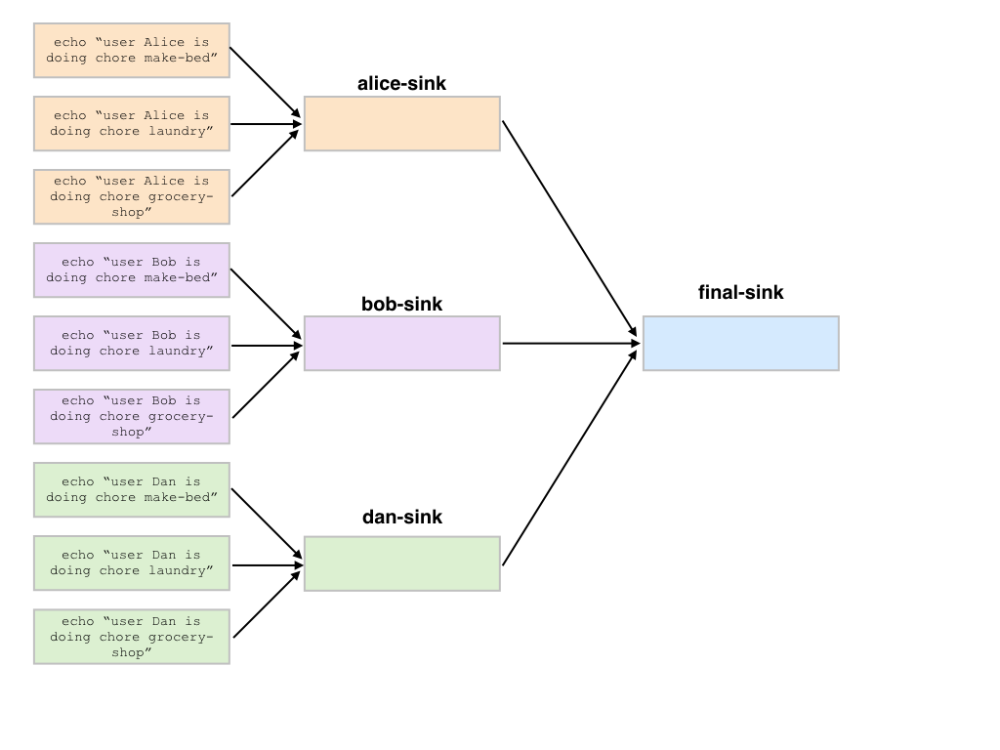

Batch
=====

Batch is a Python module for creating and executing jobs. A job consists of a bash
command to run as well as a specification of the resources required and some metadata.
Batch allows you to easily build complicated computational pipelines with many jobs and numerous
dependencies. Batches can either be executed locally or with the :ref:`Batch Service <sec-service>`.

Contents
========

.. toctree::
   :maxdepth: 2

   Getting Started <getting_started>
   Tutorial <tutorial>
   Docker Resources <docker_resources>
   Batch Service <service>
   Cookbooks <cookbook>
   Reference (Python API) <api>
   Configuration Reference <configuration_reference>
   Advanced UI Search Help <advanced_search_help>
   Change Log And Version Policy <change_log>

Indices and tables
==================

* :ref:`genindex`
* :ref:`search`
