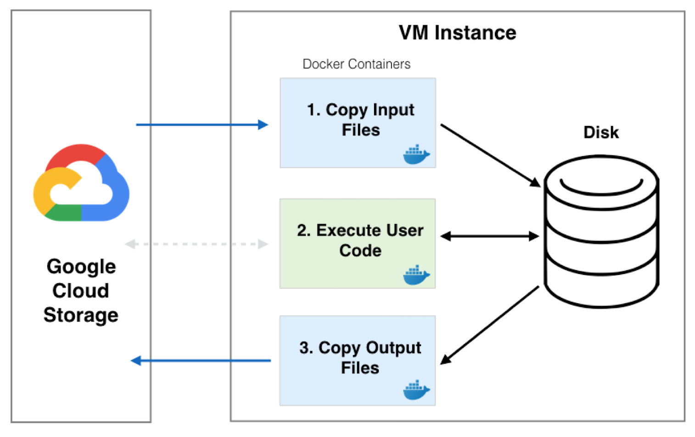

.. _sec-service:

=============
Batch Service
=============

What is the Batch Service?
--------------------------

Instead of executing jobs on your local computer (the default in Batch), you can execute
your jobs on a multi-tenant compute cluster in Google Cloud that is managed by the Hail team
and is called the Batch Service. The Batch Service consists of a scheduler that receives job
submission requests from users and then executes jobs in Docker containers on Google Compute
Engine VMs (workers) that are shared amongst all Batch users. A UI is available at `<https://batch.hail.is>`__
that allows a user to see job progress and access logs.

.. _file-localization:

File Localization
-----------------

A job is executed in three separate Docker containers: input, main, output. The input container
downloads files from Google Storage to the input container. These input files are either inputs
to the batch or are output files that have been generated by a dependent job. The downloaded
files are then passed on to the main container via a shared disk where the user's code is
executed. Finally, the output container runs and uploads any files from the shared disk that
have been specified to be uploaded by the user. These files can either be specified with
:meth:`.Batch.write_output` or are file dependencies for downstream jobs.

.. _service-accounts:

Service Accounts
----------------

A Google service account is automatically created for a new Batch user that is used by Batch to download data
on your behalf. To get the name of the service account, click on your name on the header bar or go to
`<https://auth.hail.is/user>`__.

To give the service account read and write access to a Google Storage bucket, run the following command substituting
`SERVICE_ACCOUNT_NAME` with the full service account name (ex: test@my-project.iam.gserviceaccount.com) and `BUCKET_NAME`
with your bucket name. See this `page <https://cloud.google.com/container-registry/docs/access-control>`__
for more information about access control.

.. code-block:: sh

    gsutil iam ch serviceAccount:[SERVICE_ACCOUNT_NAME]:objectAdmin gs://[BUCKET_NAME]

The Google Container Repository (GCR) is a Docker repository hosted by Google that is an alternative
to Docker Hub for storing images. It is recommended to use GCR for images that shouldn't be publically
available. If you have a GCR `associated with your project <https://cloud.google.com/container-registry/docs/>`__,
then you can enable the service account to view Docker images with the command below where
`SERVICE_ACCOUNT_NAME` is your full service account name and `PROJECT_ID` is the name of your project
you want to grant access to:

.. code-block:: sh

    gsutil iam ch serviceAccount:[SERVICE_ACCOUNT_NAME]:objectViewer gs://artifacts.[PROJECT-ID].appspot.com

If you want to run gcloud or gsutil commands within your Batch jobs, the service
account file is available at `/gsa-key/key.json` in the main container. You can authenticate using the service
account by adding the following line to your user code and using a Docker image that has gcloud and gsutil
installed.

.. code-block:: sh

    gcloud -q auth activate-service-account --key-file=/gsa-key/key.json

Billing
-------

The cost for executing a job depends on the underlying machine type and how much CPU and
memory is being requested. Currently, Batch runs most jobs on 16 core, preemptible, n1-standard
machines with 10 GB of persistent SSD boot disk and 375 GB of local SSD. The costs are as follows:

- Compute cost
   = $0.01 per core per hour

- Disk cost
   - Boot Disk

     .. code-block:: text

         Average number of days per month = 365.25 / 12 = 30.4375

         Cost per GB per month = $0.17

         Cost per core per hour = $0.17 * 10 / 30.4375 / 24 / 16

   - Local SSD

     .. code-block:: text

         Average number of days per month = 365.25 / 12 = 30.4375

         Cost per GB per month = $0.048

         Cost per core per hour = $0.048 * 375 / 30.4375 / 24 / 16

   = $0.001685 per core per hour

- IP network cost
   = $0.00025 per core per hour

- Service cost
   = $0.01 per core per hour

The sum of these costs is **$0.021935** per core per hour.

At any given moment as many as four cores of the cluster may come from a 4 core machine. If a job is
scheduled on this machine, then the cost per core hour is **$0.02774**.

.. note::

    The amount of CPU reserved for a job can be rounded up if the equivalent memory and/or storage request
    requires a larger fraction of the worker. Currently, each 1 core requested
    gets 3.75 GB of memory and 21.875 GB of storage. Therefore, if a user requests 1 CPU and 7 GB of memory,
    the user will get 2 cores for their job and will be billed for 2 cores.

.. note::

    The amount of CPU reserved for a job is rounded up to powers of two with a minimum of 0.25 cores.
    For example, a job requesting 5 cores will be rounded up to 8 cores.

.. note::

    If a worker is preempted by google in the middle of running a job, you will be billed for
    the time the job was running up until the preemption time. The job will be rescheduled on
    a different worker and run again. Therefore, if a job takes 5 minutes to run, but was preempted
    after running for 2 minutes and then runs successfully the next time it is scheduled, the
    total cost for that job will be 7 minutes.

Setup
-----

We assume you've already installed Batch as described in the
:ref:`Getting Started <sec-getting_started>` section and we have
created a user account for you and given you a billing project.

To authenticate your computer with the Batch service, run the following
command in a terminal window:

.. code-block:: sh

    hailctl auth login

Executing this command will take you to a login page in your browser window where
you can select your google account to authenticate with. If everything works successfully,
you should see a message "hailctl is now authenticated." in your browser window and no
error messages in the terminal window.

Submitting a Batch to the Service
---------------------------------

To execute a batch on the Batch service rather than locally, first
construct a :class:`.ServiceBackend` object with a billing project and
bucket for storing intermediate files.  Your service account must
have read and write access to the bucket.  Next, pass the
:class:`.ServiceBackend` object to the :class:`.Batch` constructor
with the parameter name `backend`.

An example of running "Hello World" on the Batch service rather than
locally is shown below.  You can open iPython or a Jupyter notebook
and execute the following batch:

.. code-block:: python

    >>> import hailtop.batch as hb # doctest: +SKIP
    >>> backend = hb.ServiceBackend('my-billing-project', 'my-bucket') # doctest: +SKIP
    >>> b = hb.Batch(backend=backend, name='test') # doctest: +SKIP
    >>> j = b.new_job(name='hello') # doctest: +SKIP
    >>> j.command('echo "hello world"') # doctest: +SKIP
    >>> b.run(open=True) # doctest: +SKIP

You may elide the ``billing_project`` and ``bucket`` parameters if you
have previously set them with ``hailctl``:

.. code-block:: sh

    hailctl config set batch/billing_project my-billing-project
    hailctl config set batch/bucket my-bucket

Using the UI
------------

If you have submitted the batch above successfully, then it should open a page in your
browser with a UI page for the batch you submitted. This will show a list of all the jobs
in the batch with the current state, exit code, duration, and cost. The possible job states
are as follows:

- Pending - A job is waiting for its dependencies to complete
- Ready - All of a job's dependencies have completed, but the job has not been scheduled to run
- Running - A job has been scheduled to run on a worker
- Success - A job finished with exit code 0
- Failure - A job finished with exit code not equal to 0
- Error - The Docker container had an error (ex: out of memory)

Clicking on a specific job will take you to a page with the logs for each of the three containers
run per job (:ref:`see above <file-localization>`) as well as a copy of the job spec and detailed
information about the job such as where the job was run, how long it took to pull the image for
each container, and any error messages.

To see all batches you've submitted, go to `<https://batch.hail.is>`__. Each batch will have a current state,
number of jobs total, and the number of pending, succeeded, failed, and cancelled jobs as well as the
running cost of the batch (computed from completed jobs only). The possible batch states are as follows:

- open - Not all jobs in the batch have been successfully submitted.
- running - All jobs in the batch have been successfully submitted.
- success - All jobs in the batch have completed with state "Success"
- failure - Any job has completed with state "Failure" or "Error"
- cancelled - Any job has been cancelled and no jobs have completed with state "Failure" or "Error"

.. note::
    Jobs can still be running even if the batch has been marked as failure or cancelled. In the case of
    'failure', other jobs that do not depend on the failed job will still run. In the case of cancelled,
    it takes time to cancel a batch, especially for larger batches.

Individual jobs cannot be cancelled or deleted. Instead, you can cancel the entire batch with the "Cancel"
button next to the row for that batch. You can also delete a batch with the "Delete" button.

.. warning::

    Deleting a batch only removes it from the UI. You will still be billed for a deleted batch.
