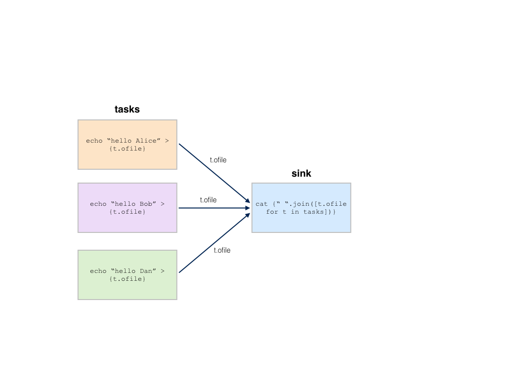

.. _sec-tutorial:

========
Tutorial
========

This tutorial goes through the basic concepts of Batch with examples.

Import
------

Batch is located inside the `hailtop` module, which can be installed
as described in the :ref:`Getting Started <sec-getting_started>` section.

.. code-block:: python

    >>> import hailtop.batch as hb

.. _f-strings:

f-strings
---------

f-strings were added to Python in version 3.6 and are denoted by the 'f' character
before a string literal. When creating the string, Python evaluates any expressions
in single curly braces `{...}` using the current variable scope. When Python compiles
the example below, the string 'Alice' is substituted for `{name}` because the variable
`name` is set to 'Alice' in the line above.

.. code-block:: python

    >>> name = 'Alice'
    >>> print(f'hello {name}')
    hello Alice

You can put any arbitrary Python code inside the curly braces and Python will evaluate
the expression correctly. For example, below we evaluate `x + 1` first before compiling
the string. Therefore, we get 'x = 6' as the resulting string.

.. code-block:: python

    >>> x = 5
    >>> print(f'x = {x + 1}')
    x = 6

To use an f-string and output a single curly brace in the output string, escape the curly
brace by duplicating the character. For example, `{` becomes `{{` in the string definition,
but will print as `{`. Likewise, `}` becomes `}}`, but will print as `}`.

.. code-block:: python

    >>> x = 5
    >>> print(f'x = {{x + 1}} plus {x}')
    x = {x + 1} plus 5

To learn more about f-strings, check out this `tutorial <https://www.datacamp.com/community/tutorials/f-string-formatting-in-python>`_.

Hello World
-----------

A :class:`.Batch` consists of a set of :class:`.Job` to execute. There can be
an arbitrary number of jobs in the batch that are executed in order of their dependencies.
A dependency between two jobs states that the dependent job should not run until
the previous job completes. Thus, under the covers a batch is a directed acyclic graph (DAG)
of jobs.

In the example below, we have defined a :class:`.Batch` `b` with the name 'hello'.
We use the method :meth:`.Batch.new_job` to create a job object which we call `j` and then
use the method :meth:`.BashJob.command` to tell Batch that we want to execute `echo "hello world"`.
However, at this point, Batch hasn't actually run the job to print "hello world". All we have
done is specified the jobs and the order in which they should be run. To actually execute the
Batch, we call :meth:`.Batch.run`. The `name` arguments to both :class:`.Batch` and
:class:`.Job` are used in the :ref:`Batch Service UI <sec-service>`.

.. code-block:: python

    >>> b = hb.Batch(name='hello')
    >>> j = b.new_job(name='j1')
    >>> j.command('echo "hello world"')
    >>> b.run()

Now that we know how to create a batch with a single job, we call :meth:`.Batch.new_job`
twice to create two jobs `s` and `t` which both will print a variant of hello world to stdout.
Calling `b.run()` executes the batch. By default, batches are executed by the :class:`.LocalBackend`
which runs jobs on your local computer. Therefore, even though these jobs can be run in parallel,
they are still run sequentially. However, if batches are executed by the :class:`.ServiceBackend`
using the :ref:`Batch Service <sec-service>`, then `s` and `t` can be run in parallel as
there exist no dependencies between them.

.. code-block:: python

    >>> b = hb.Batch(name='hello-parallel')
    >>> s = b.new_job(name='j1')
    >>> s.command('echo "hello world 1"')
    >>> t = b.new_job(name='j2')
    >>> t.command('echo "hello world 2"')
    >>> b.run()

To create a dependency between `s` and `t`, we use the method
:meth:`.Job.depends_on` to explicitly state that `t` depends on `s`. In both the
:class:`.LocalBackend` and :class:`.ServiceBackend`, `s` will always run before
`t`.

.. code-block:: python

    >>> b = hb.Batch(name='hello-serial')
    >>> s = b.new_job(name='j1')
    >>> s.command('echo "hello world 1"')
    >>> t = b.new_job(name='j2')
    >>> t.command('echo "hello world 2"')
    >>> t.depends_on(s)
    >>> b.run()

.. _file-dependencies:

File Dependencies
-----------------

So far we have created batches with two jobs where the dependencies between
them were declared explicitly. However, in many computational pipelines, we want to
have a file generated by one job be the input to a downstream job. Batch has a
mechanism for tracking file outputs and then inferring job dependencies from the usage of
those files.

In the example below, we have specified two jobs: `s` and `t`. `s` prints
"hello world" as in previous examples. However, instead of printing to stdout,
this time `s` redirects the output to a temporary file defined by `s.ofile`.
`s.ofile` is a Python object of type :class:`.JobResourceFile` that was created
on the fly when we accessed an attribute of a :class:`.Job` that does not already
exist. Any time we access the attribute again (in this example `ofile`), we get the
same :class:`.JobResourceFile` that was previously created. However, be aware that
you cannot use an existing method or property name of :class:`.Job` objects such
as :meth:`.BashJob.command` or :meth:`.BashJob.image`.

Note the 'f' character before the string in the command for `s`! We placed `s.ofile` in curly braces so
when Python interpolates the :ref:`f-string <f-strings>`, it replaced the
:class:`.JobResourceFile` object with an actual file path into the command for `s`.
We use another f-string in `t`'s command where we print the contents of `s.ofile` to stdout.
`s.ofile` is the same temporary file that was created in the command for `t`. Therefore,
Batch deduces that `t` must depend on `s` and thus creates an implicit dependency for `t` on `s`.
In both the :class:`.LocalBackend` and :class:`.ServiceBackend`, `s` will always run before `t`.

.. code-block:: python

    >>> b = hb.Batch(name='hello-serial')
    >>> s = b.new_job(name='j1')
    >>> s.command(f'echo "hello world" > {s.ofile}')
    >>> t = b.new_job(name='j2')
    >>> t.command(f'cat {s.ofile}')
    >>> b.run()

Scatter / Gather
----------------

Batch is implemented in Python making it easy to use for loops
to create more complicated dependency graphs between jobs. A scatter
is a set of jobs with the same command but varying input parameters. A gather
is a final job or "sink" that waits for all of the jobs in the scatter to be complete
before executing.

In the example below, we use a for loop to create a job for each one of
'Alice', 'Bob', and 'Dan' that prints the name of the user programatically
thereby scattering the echo command over users.

.. code-block:: python

    >>> b = hb.Batch(name='scatter')
    >>> for name in ['Alice', 'Bob', 'Dan']:
    ...     j = b.new_job(name=name)
    ...     j.command(f'echo "hello {name}"')
    >>> b.run()

In the previous example, we did not assign the jobs we created for each
user to a unique variable name and instead named it `j` each time in the
for loop. However, if we want to add a final gather job (`sink`) that depends on the
completion of all user jobs, then we need to keep track of all of the user
jobs so we can use the :meth:`.Job.depends_on` method to explicitly link
the `sink` job to be dependent on the user jobs, which are stored in the
`jobs` array. The single asterisk before `jobs` is used in Python to have
all elements in the array be treated as separate input arguments to the function,
in this case :meth:`.Job.depends_on`.

.. image:: _static/images/dags/dags.005.png

.. code-block:: python

    >>> b = hb.Batch(name='scatter-gather-1')
    >>> jobs = []
    >>> for name in ['Alice', 'Bob', 'Dan']:
    ...     j = b.new_job(name=name)
    ...     j.command(f'echo "hello {name}"')
    ...     jobs.append(j)
    >>> sink = b.new_job(name='sink')
    >>> sink.command(f'echo "I wait for everyone"')
    >>> sink.depends_on(*jobs)
    >>> b.run()

Now that we know how to create a `sink` job that depends on an arbitrary
number of jobs, we want to have the outputs of each of the per-user jobs
be implicit file dependencies in the `sink` job (see the section on
:ref:`file dependencies <file-dependencies>`). The changes from the previous
example to make this happen are each job `j` uses an :ref:`f-string <f-strings>`
to create a temporary output file `j.ofile` where the output to echo is redirected.
We then use all of the output files in the `sink` command by creating a string
with the temporary output file names for each job. A :class:`.JobResourceFile`
is a Batch-specific object that inherits from `str`. Therefore, you can use
:class:`.JobResourceFile` as if they were strings, which we do with the `join`
command for strings.

.. code-block:: python

    >>> b = hb.Batch(name='scatter-gather-2')
    >>> jobs = []
    >>> for name in ['Alice', 'Bob', 'Dan']:
    ...     j = b.new_job(name=name)
    ...     j.command(f'echo "hello {name}" > {j.ofile}')
    ...     jobs.append(j)
    >>> sink = b.new_job(name='sink')
    >>> sink.command('cat {}'.format(' '.join([j.ofile for j in jobs])))
    >>> b.run()

Nested Scatters
---------------

We can also create a nested scatter where we have a series of jobs per user.
This is equivalent to a nested for loop. In the example below, we instantiate a
new :class:`.Batch` object `b`. Then for each user in 'Alice', 'Bob', and 'Dan'
we create new jobs for making the bed, doing laundry, and grocery shopping. In total,
we will have created 9 jobs that run in parallel as we did not define any dependencies
between the jobs.

.. code-block:: python

    >>> b = hb.Batch(name='nested-scatter-1')
    >>> for user in ['Alice', 'Bob', 'Dan']:
    ...     for chore in ['make-bed', 'laundry', 'grocery-shop']:
    ...         j = b.new_job(name=f'{user}-{chore}')
    ...         j.command(f'echo "user {user} is doing chore {chore}"')
    >>> b.run()

We can implement the same example as above with a function that implements the inner
for loop. The `do_chores` function takes a :class:`.Batch` object to add new jobs
to and a user name for whom to create chore jobs for. Like above, we create 9 independent
jobs. However, by structuring the code into smaller functions that take batch objects,
we can create more complicated dependency graphs and reuse components across various computational
pipelines.

.. code-block:: python

    >>> def do_chores(b, user):
    ...     for chore in ['make-bed', 'laundry', 'grocery-shop']:
    ...         j = b.new_job(name=f'{user}-{chore}')
    ...         j.command(f'echo "user {user} is doing chore {chore}"')

    >>> b = hb.Batch(name='nested-scatter-2')
    >>> for user in ['Alice', 'Bob', 'Dan']:
    ...     do_chores(b, user)
    >>> b.run()

Lastly, we provide an example of a more complicated batch that has an initial
job, then scatters jobs per user, then has a series of gather / sink jobs
to wait for the per user jobs to be done before completing.

.. image:: _static/images/dags/dags.008.png

.. code-block:: python

    >>> def do_chores(b, head, user):
    ...     chores = []
    ...     for chore in ['make-bed', 'laundry', 'grocery-shop']:
    ...         j = b.new_job(name=f'{user}-{chore}')
    ...         j.command(f'echo "user {user} is doing chore {chore}"')
    ...         j.depends_on(head)
    ...         chores.append(j)
    ...     sink = b.new_job(name=f'{user}-sink')
    ...     sink.depends_on(*chores)
    ...     return sink

    >>> b = hb.Batch(name='nested-scatter-3')
    >>> head = b.new_job(name='head')
    >>> user_sinks = []
    >>> for user in ['Alice', 'Bob', 'Dan']:
    ...     user_sink = do_chores(b, head, user)
    ...     user_sinks.append(user_sink)
    >>> final_sink = b.new_job(name='final-sink')
    >>> final_sink.depends_on(*user_sinks)
    >>> b.run()

.. _input-files:

Input Files
-----------

Previously, we discussed that :class:`.JobResourceFile` are temporary files and
are created from :class:`.Job` objects. However, in order to read a file that
was not generated by executing jobs (input file), we use the method
:meth:`.Batch.read_input` to create an :class:`.InputResourceFile`. An input
resource file can be used exactly in the same way as a
:class:`.JobResourceFile`.  We can refer to an input resource file in a command
using an f-string. In the example below, we add the file `data/hello.txt` as an
input resource file called `input`. We then print the contents of `input` to
stdout in :class:`.Job` `j`.

.. code-block:: python

    >>> b = hb.Batch(name='hello-input')
    >>> input = b.read_input('data/hello.txt')
    >>> j = b.new_job(name='hello')
    >>> j.command(f'cat {input}')
    >>> b.run()

Why do we need to explicitly add input files to batches rather than referring
directly to the path in the command? You could refer directly to the path when using the
:class:`.LocalBackend`, but only if you are not specifying a docker image to use when running
the command with :meth:`.BashJob.image`. This is because Batch copies any input files to a special
temporary directory which gets mounted to the Docker container. When using the :class:`.ServiceBackend`,
input files would be files in Google Storage. Many commands do not know how to handle file
paths in Google Storage. Therefore, we suggest explicitly adding all input files as input resource
files to the batch so to make sure the same code can run in all scenarios. Files that are already
in a Docker image do not need to be read as inputs to the batch.

Output Files
------------

All files generated by Batch are temporary files! They are copied as appropriate between jobs
for downstream jobs' use, but will be removed when the batch has completed. In order to save
files generated by a batch for future use, you need to explicitly call :meth:`.Batch.write_output`.
The first argument to :meth:`.Batch.write_output` can be any type of :class:`.ResourceFile` which includes input resource
files and job resource files as well as resource groups as described below. The second argument to write_output
should be either a local file path or a google storage file path when using the :class:`.LocalBackend`.
For the :class:`.ServiceBackend`, the second argument must be a google storage file path.

.. code-block:: python

    >>> b = hb.Batch(name='hello-input')
    >>> j = b.new_job(name='hello')
    >>> j.command(f'echo "hello" > {j.ofile}')
    >>> b.write_output(j.ofile, 'output/hello.txt')
    >>> b.run()

Resource Groups
---------------

Many bioinformatics tools treat files as a group with a common file
path and specific file extensions. For example, `PLINK <https://www.cog-genomics.org/plink/>`_
stores genetic data in three files: `*.bed` has the genotype data,
`*.bim` has the variant information, and `*.fam` has the sample information.
PLINK can take as an input the path to the files expecting there will be three
files with the appropriate extensions. It also writes files with a common file root and
specific file extensions including when writing out a new dataset or outputting summary statistics.

To enable Batch to work with file groups, we added a :class:`.ResourceGroup` object
that is essentially a dictionary from file extension name to file path. When creating
a :class:`.ResourceGroup` in a :class:`.Job` (equivalent to a :class:`.JobResourceFile`),
you first need to use the method :meth:`.BashJob.declare_resource_group` to declare the files
in the resource group explicitly before referring to the resource group in a command.
This is because the default when referring to an attribute on a job that has not been defined
before is to create a :class:`.JobResourceFile` and not a resource group.

In the example below, we first declare that `create.bfile` will be a resource group with three files.
The attribute name comes from the name of the key word argument `bfile`. The constructor expects
a dictionary as the value for the key word argument. The dictionary defines the names of each of the files
and the file path where they should be located. In this example, the file paths contain
`{root}` which is the common temporary file path that will get substituted in to create the
final file path. Do not use f-strings here as we substitute a value for `{root}` when creating
the resource group!

We can then refer to `create.bfile` in commands which gets interpolated with the common temporary file root path
(equivalent to `{root}`) or we can refer to a specific file in the resource group such as `create.bfile.fam`.

.. code-block:: python

    >>> b = hb.Batch(name='resource-groups')
    >>> create = b.new_job(name='create-dummy')
    >>> create.declare_resource_group(bfile={'bed': '{root}.bed',
    ...                                      'bim': '{root}.bim',
    ...                                      'fam': '{root}.fam'})
    >>> create.command(f'plink --dummy 10 100 --make-bed --out {create.bfile}')
    >>> b.run() # doctest: +SKIP

As described previously for :ref:`input files <input-files>`, we need a
separate mechanism for creating a resource group from a set of input files
using the method :meth:`.Batch.read_input_group`. The constructor takes
key word arguments that define the name of the file such as `bed` to the path
where that file is located. The resource group is then a dictionary of the name
of the attribute to an :class:`.InputResourceFile`.

In the example below, we created an input resource group `bfile` with three files.
The group's common root file path can be referred to with `bfile` in a command or
you can reference a specific input file such as `bfile.fam`.

.. code-block:: python

    >>> b = hb.Batch(name='resource-groups')
    >>> bfile = b.read_input_group(bed='data/example.bed',
    ...                            bim='data/example.bim',
    ...                            fam='data/example.fam')
    >>> wc_bim = b.new_job(name='wc-bim')
    >>> wc_bim.command(f'wc -l {bfile.bim}')
    >>> wc_fam = b.new_job(name='wc-fam')
    >>> wc_fam.command(f'wc -l {bfile.fam}')
    >>> b.run()

Resource File Extensions
------------------------

If your tool requires a specific extension for the input files in a resource group,
then you'd need to create the resource group as follows:

.. code-block:: python

    >>> b = hb.Batch(name='resource-file-extensions')
    >>> rg = b.read_input_group(**{'txt.gz': 'data/hello.txt.gz'})
    >>> rg['txt.gz']

Python Jobs
-----------

Up until now we have used the :meth:`.Batch.new_job` method to create a new :class:`.BashJob`.
The jobs run a command that is assumed to be a bash command. However, Batch also has an
alternate type of job called a :class:`.PythonJob`. Unlike :class:`.BashJob`, :class:`.PythonJob`
does not have a :meth:`.BashJob.command` method and instead have a :meth:`.PythonJob.call` method
that takes a Python function to call and the positional arguments and key-word arguments to provide
to the function. The result of :meth:`.PythonJob.call` is a :class:`.PythonResult` which can be
used as either arguments to another :class:`.PythonJob` or to other :class:`.BashJob` by using one
of the methods to convert a :class:`.PythonResult` to a file: :meth:`.PythonResult.as_str`,
:meth:`.PythonResult.as_repr`, and :meth:`.PythonResult.as_json`.

In the example below, we first define two Python functions: `hello_world()` and `upper()`.
Next, we create a batch and then create a new PythonJob with :meth:`.Batch.new_python_job`.
Then we use :meth:`.PythonJob.call` and pass the `hello_world` function that we want to call.
Notice we just passed the reference to the function and not ``hello_world()``. We also add
a Python string `alice` as an argument to the function. The result of the ``j.call()`` is
a :class:`.PythonResult` which we've assigned to the variable `hello_str`.

We want to use the `hello_str` result and make all the letters in upper case. We call
:meth:`.PythonJob.call` and pass a reference to the `upper` function.
But now the argument is `hello_str` which holds the result from calling `hello_world`
above. We assign the new output to the variable `result`.

At this point, we want to write out the transformed hello world result to a text file.
However, `result` is a :class:`.PythonResult`. Therefore, we need to use the :meth:`.PythonResult.as_str`
to convert `result` to a :class:`.JobResourceFile` with the string output `HELLO WORLD ALICE`. Now
we can write the result to a file.

.. code-block:: python

    def hello_world(name):
        return f'hello {name}'

    def upper(s):
        return s.upper()

    b = hb.Batch(name='hello')
    j = b.new_python_job()
    hello_str = j.call(hello_world, 'alice')
    result = j.call(upper, hello_str)
    b.write_output(result.as_str(), 'output/hello-alice.txt')
    b.run()

Backends
--------

There are two backends that execute batches: the :class:`.LocalBackend` and the
:class:`.ServiceBackend`. The local backend is used by default and executes jobs
on your local computer. The service backend executes jobs in a shared compute cluster
managed by the Hail team. To use the Batch Service, follow the directions :ref:`here <sec-service>`.
